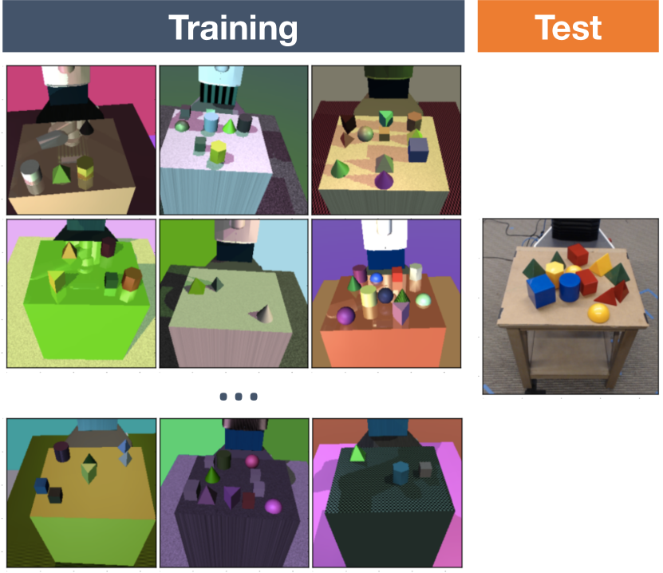
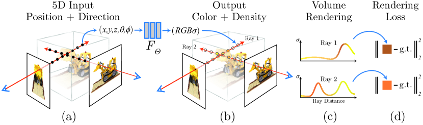
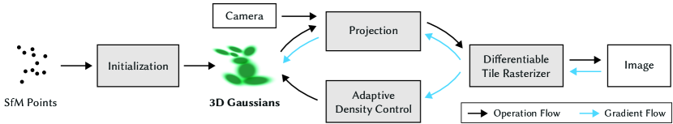
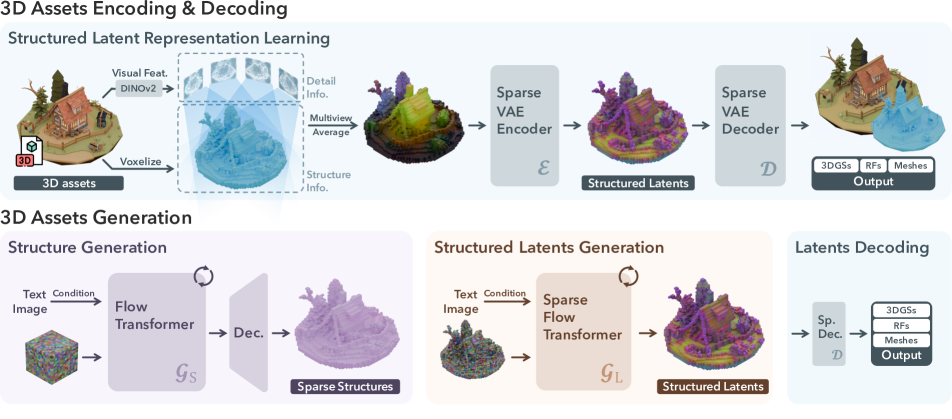
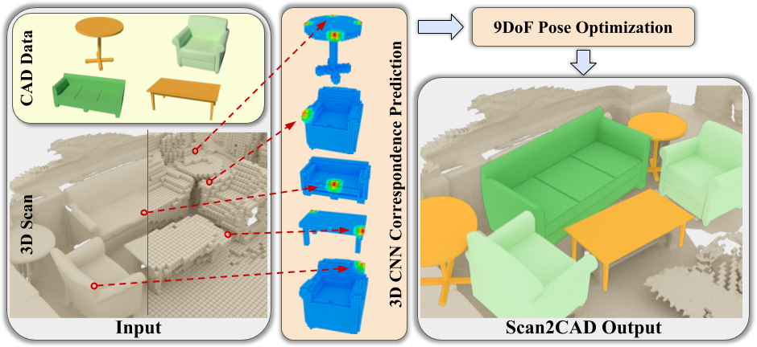
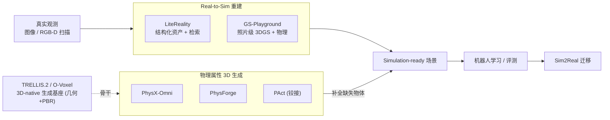

# Sim2Real 与 Simulation-Ready 3D 阅读笔记

> 本仓库包含 7 篇 Sim2Real 与 simulation-ready 3D 方向论文的精读笔记，以及一份三维表示入门材料。每篇笔记统一整理核心思想、输入输出、符号与公式、论文原图、方法细节、结构化对比、源码核对和开放问题。
> 核心阅读清单见 [references/papers.md](references/papers.md)，实验复现见 [reproductions/](reproductions/)，环境说明见 [environments/](environments/)。

## 仓库结构

```text
.
|-- README.md                 # 领域框架、阅读顺序与横向比较
|-- notes/                    # 逐篇精读笔记与三维表示教程
|   `-- figures/             # 论文图示与本地复现结果
|-- reproductions/           # PAct 与 O-Voxel 复现记录
|-- environments/            # 最小依赖和实测版本
`-- references/              # 核心论文及上游项目链接
```

本仓库不包含预训练权重、数据集、虚拟环境、论文全文或上游项目源码。第三方图像的权利归原作者及出版方所有，具体说明见 [NOTICE.md](NOTICE.md)。

---

## 0. 领域框架

> 本节用于建立阅读这些论文所需的共同背景，包括问题定义、技术路线、关键术语和前置文献。

### 0.1 问题背景

Sim2Real（仿真到现实）的目标是：先在仿真器中训练机器人完成行走、抓取或开门等技能，再将策略迁移到真实机器人，并尽可能保持其性能与稳定性。

真实机器人训练成本高、数据采集速度慢，并伴随设备损坏与安全风险。仿真可以并行运行大量环境，显著提高数据采集效率。然而，仿真与现实在视觉外观、物理参数和场景多样性上存在 **reality gap（域差距）**，由此可能导致策略在仿真中有效、在真实环境中失效。

本清单关注域差距中的环境构建问题：人工资产通常缺少真实场景的多样性，而 NeRF 或 3DGS 等重建结果虽然具有较高视觉保真度，却不一定包含可交互的对象结构与物理属性。因此，核心研究问题可以表述为：

> **如何将单张图像或 RGB-D 扫描自动转换为兼具视觉保真度、结构可编辑性和物理可交互性的三维资产或场景，并将其用于机器人学习？**

贯穿这些工作的核心区分是：**视觉保真的三维表示不等同于 simulation-ready 资产**。NeRF 或 3DGS 可以准确复现视图外观，但若缺少独立对象、碰撞体、质量、摩擦、关节和运动限位，仍无法直接支持机器人抓取、开门或接触动力学仿真。

### 0.2 两条主要技术路线

```text
真实世界 ──┬── (A) 重建 Real-to-Sim：把"已存在的真实场景"扫描/拍照 → 还原成可交互 3D
           │        代表：GS-Playground(#4 照片级3DGS) / LiteReality(#5 检索式CAD)
           │
           └── (B) 生成 Generation：根据单张图像生成带有物理属性的 3D 物体
                    代表：PhysX-Anything(#7) / PhysX-Omni(#1) / PhysForge(#2) / PAct(#3)
                    生成基座：TRELLIS.2（#6，提供几何与 PBR 表示）
两者最终汇合 → simulation-ready 场景/资产 → 机器人学习 → Sim2Real 迁移
```

### 0.3 关键概念

下表汇总这些论文中反复出现的术语与定义。

| 术语 | 定义 |
|---|---|
| **Sim2Real** | 将在仿真环境中训练的策略部署到真实机器人；反向过程 **Real2Sim** 是将真实观测重建为可用于仿真的数字环境。 |
| **Reality gap / 域差距** | 仿真与现实在视觉外观、动力学参数和传感器特性等方面的差异，可能导致策略迁移后性能下降。 |
| **Domain randomization（域随机化）** | 在训练期间随机化纹理、光照、相机和物理参数，使策略学习对环境变化更稳健的特征。 |
| **Embodied AI（具身智能）** | 研究智能体如何通过身体在环境中完成感知、决策与行动，典型载体包括机器人和机械臂。 |
| **Simulation-ready / sim-ready** | 可直接被仿真器使用的三维资产；除几何与纹理外，通常还需要碰撞体、质量、摩擦、关节和运动限位等属性。 |
| **Articulation（铰接）** | 由可动部件及其关节组成的结构。常见关节包括旋转关节（revolute）和平移关节（prismatic），并需定义关节类型、轴和运动范围。 |
| **URDF / MJCF / USD** | 描述机器人、对象或场景结构的常用格式，分别广泛用于 ROS、MuJoCo 和 NVIDIA Omniverse/Isaac 等生态。能否稳定导出这些格式是评估仿真兼容性的关键依据。 |
| **PBR 材质** | Physically-Based Rendering 材质，通常使用 base color、metallic、roughness 和 opacity 等参数，使资产能够在不同光照条件下保持一致的材质响应。 |
| **NeRF / 3DGS** | 两类主流的多视角三维重建表示。NeRF 使用神经网络隐式表示辐射场；3D Gaussian Splatting 使用带位置、协方差、颜色和不透明度的三维高斯进行显式表示。 |
| **体素 Voxel / SLAT** | 体素是规则三维网格中的基本单元。TRELLIS 的 SLAT（structured latent）以稀疏体素坐标和局部特征构成三维生成的中间表示。 |
| **VLM（视觉语言模型）** | 联合处理图像与文本的多模态模型。本清单中的多种方法使用 VLM 从图像推断对象结构、部件关系和物理描述。 |
| **Diffusion / Flow Matching** | 两类生成建模范式。扩散模型学习逐步去噪过程；flow matching 直接学习连接噪声分布与数据分布的连续速度场。 |
| **Feed-forward vs 优化式** | 前馈方法通过一次或有限次网络推理产生结果，速度较快；优化式方法针对每个实例迭代拟合，通常计算成本更高。 |
| **Digital twin（数字孪生）** | 真实对象或场景在数字环境中的高保真、可更新且可交互的表示。 |

> 三维表示（mesh、点云、体素、SDF、NeRF、3DGS、SLAT、O-Voxel、URDF）是理解本方向的基础，可结合以下两份材料阅读：
> - 文字速查：[08-3D表示理解.md](notes/08-3D表示理解.md) —— 通过表格比较各类表示的渲染、编辑和仿真能力。
> - 可视化版：[3d_representations_tutorial.ipynb](notes/3d_representations_tutorial.ipynb)（[HTML 预览](notes/3d_representations_tutorial.html)）—— 通过程序构建桌子示例，并展示 mesh、点云、体素和 SDF 之间的转换过程，共包含 7 张可运行图示。

### 0.4 如何阅读每篇笔记

每篇精读笔记现在采用统一结构：

1. **核心思想**：概括论文解决的问题、主要机制和适用范围。
2. **输入、输出与问题定义**：明确模型接收的数据、产生的中间表示和最终资产。
3. **符号与核心公式**：解释论文中的关键变量、目标函数、几何关系或动力学方程。
4. **方法细节与原图**：按照论文 pipeline 展开各模块。
5. **结构化速记**：比较表示、物理属性、仿真器兼容性、指标和局限。
6. **机理与代码对照**：区分论文明确陈述、源码验证结果和个人推断。
7. **核对结果与开放问题**：记录已经确认的事实和仍需实验验证的问题。

公式来源遵循以下原则：论文明确给出的公式直接按原符号整理；源码中的实现公式会注明“来自开源实现”；为辅助理解而增加的形式化表达会明确说明并非论文原式。

### 0.5 前置文献

以下文献不属于 7 篇精读论文，但构成理解仿真器、Sim2Real、三维表示、生成模型和铰接对象的基础背景。部分条目附有原文核心图，存放于 [figures/refs/](notes/figures/refs/)。

**A. 仿真器与具身平台**
- **MuJoCo** — Todorov et al., *MuJoCo: A physics engine for model-based control*, IROS 2012. 接触动力学仿真的事实标准。[官网](https://mujoco.org/) ｜ [论文 PDF](https://homes.cs.washington.edu/~todorov/papers/TodorovIROS12.pdf)
- **SAPIEN / PartNet-Mobility** — Xiang et al., CVPR 2020. 提供大量**铰接物体**数据集（本清单 PAct/PhysForge 都用）。[arXiv 2003.08515](https://arxiv.org/abs/2003.08515)
- **Isaac Gym** — Makoviychuk et al., 2021. GPU 上**上万并行环境**，让大规模 RL 成为可能（后续为 Isaac Lab）。[arXiv 2108.10470](https://arxiv.org/abs/2108.10470)
- **Genesis** (2024) — 新一代高速通用物理引擎。[GitHub](https://github.com/Genesis-Embodied-AI/Genesis) ｜ **Habitat** [arXiv 1904.01201](https://arxiv.org/abs/1904.01201) / [2.0 2106.14405](https://arxiv.org/abs/2106.14405) ｜ **AI2-THOR** [arXiv 1712.05474](https://arxiv.org/abs/1712.05474) / **ProcTHOR** [arXiv 2206.06994](https://arxiv.org/abs/2206.06994)

**B. Sim2Real 的经典方法**
- **Domain Randomization** — Tobin et al., IROS 2017. Sim2Real 中具有代表性的经典方法。[arXiv 1703.06907](https://arxiv.org/abs/1703.06907)
- **OpenAI Dactyl** — *Learning Dexterous In-Hand Manipulation*, 2018. 域随机化训练→真机灵巧手的里程碑。[arXiv 1808.00177](https://arxiv.org/abs/1808.00177)


> **域随机化机理（Tobin 2017 Fig.1）**：在仿真训练中随机化纹理、光照、相机与干扰对象，生成大规模低保真数据。当随机分布能够覆盖真实环境变化时，模型更有可能学习跨域稳定的特征，从而支持零样本迁移。

**C. 三维表示与重建**
- **NeRF** — Mildenhall et al., ECCV 2020. 神经辐射场，开启可微渲染重建热潮。[arXiv 2003.08934](https://arxiv.org/abs/2003.08934)
- **3D Gaussian Splatting (3DGS)** — Kerbl et al., SIGGRAPH 2023. 实时高质量重建，本清单 #4 的底层表示。[arXiv 2308.04079](https://arxiv.org/abs/2308.04079)
- **Instant-NGP** — Müller et al., 2022. 极快的 NeRF 变体（多分辨率哈希编码）。[arXiv 2201.05989](https://arxiv.org/abs/2201.05989)


> **NeRF 机理（Fig.2）**：把场景表示成一个 MLP，输入 5D（空间位置 xyz + 视角方向 θφ）→ 输出该点的**颜色 + 体密度**；沿相机光线采样、用**体渲染**积分成像素，再与真图比对反传优化。隐式、连续，但慢。


> **3DGS 机理（Fig.2）**：从 SfM 稀疏点云初始化一组具有位置、协方差、颜色和不透明度参数的三维高斯，通过可微光栅化进行渲染，并依据梯度自适应增密或裁剪高斯。该表示显式且渲染效率高，因此 GS-Playground（#4）将其用于高吞吐仿真渲染。

**D. 三维生成**
- **DDPM（扩散模型）** — Ho et al., NeurIPS 2020. 扩散生成基石。[arXiv 2006.11239](https://arxiv.org/abs/2006.11239)
- **Flow Matching** — Lipman et al., ICLR 2023. 本清单 PAct/PhysForge 用的训练范式（比扩散更高效）。[arXiv 2210.02747](https://arxiv.org/abs/2210.02747)
- **DreamFusion** — Poole et al., 2022. SDS loss，文本→3D 的代表（优化式）。[arXiv 2209.14988](https://arxiv.org/abs/2209.14988)
- **TRELLIS** — Xiang et al., 2024. 本清单 #1/#2/#3/#6 的共同生成基础，阅读时应重点理解其 SLAT 表示。[arXiv 2412.01506](https://arxiv.org/abs/2412.01506)


> **扩散模型机理（DDPM Fig.2）**：前向过程逐步向数据加入高斯噪声，直至接近标准噪声分布；模型学习逆向去噪过程。生成时从随机噪声出发，逐步恢复数据样本。三维生成可将其中的数据表示替换为体素或潜变量。


> **TRELLIS 机理（Fig.2）**：SLAT（structured latent）由稀疏体素坐标与逐体素局部特征组成，可作为三维资产的统一中间表示，并解码为 mesh、3DGS 或辐射场。PAct 对 TRELLIS 进行微调，OmniPart/PhysForge 基于其表示扩展，PhysX 系列使用相关解码路径。

**E. Pipeline 中常用的视觉基础模型**
- **CLIP** — Radford et al. 2021. 图文对齐模型，常用于跨模态检索与相似度评分。[arXiv 2103.00020](https://arxiv.org/abs/2103.00020)
- **DINOv2** — Oquab et al. 2023. 自监督视觉特征模型，LiteReality（#5）使用其特征执行资产检索。[arXiv 2304.07193](https://arxiv.org/abs/2304.07193)
- **SAM / SAM2** — Kirillov et al. 2023 / 2024. 通用图像分割模型，常用于 Real2Sim pipeline 中的对象掩码提取。[SAM 2304.02643](https://arxiv.org/abs/2304.02643) ｜ [SAM2 2408.00714](https://arxiv.org/abs/2408.00714)
- **Grounding DINO** — Liu et al. 2023. 开放词表目标检测模型，可与 SAM 组合完成文本条件下的对象检测与分割。[arXiv 2303.05499](https://arxiv.org/abs/2303.05499)

**F. 铰接对象与 Real-to-Sim 专题**
- **Scan2CAD** — Avetisyan et al. 2019. 把扫描里的物体对齐到 CAD 模型，LiteReality(#5) 的检索基准。[arXiv 1811.11187](https://arxiv.org/abs/1811.11187)
- **URDFormer** — Chen et al. 2024. 从真实图像构造铰接仿真环境。[arXiv 2405.11656](https://arxiv.org/abs/2405.11656) ｜ **Articulate-Anything** — Le et al. 2024. VLM 驱动铰接建模。[arXiv 2410.13882](https://arxiv.org/abs/2410.13882)（两者都是本清单生成类的对比基线）
- **ACDC / Digital Cousins** — Dai et al. 2024. 从单张图像构建可用于仿真的数字场景。[arXiv 2410.07408](https://arxiv.org/abs/2410.07408)


> **Scan2CAD 机理（Fig.1）**：输入带噪 RGB-D 扫描与 CAD 候选集合，模型预测扫描和 CAD 模型之间的关键点对应关系，并将结构清晰的 CAD 资产对齐到扫描对象。这一范式构成 LiteReality（#5）检索式重建路线的重要基础。

### 0.6 建议阅读顺序

以下顺序可作为入门路径，也可以根据研究目标选择相应分支：

```text
打基础：
  0.1~0.3 基础概念 → TRELLIS(D) 三维生成表示 → 3DGS(C) 三维重建表示
        → #6 TRELLIS.2（生成基座）→ #7/#1 PhysX 系列（生成与 MuJoCo 仿真闭环）

侧重 Real-to-Sim 重建：
  #5 LiteReality(结构化/可编辑) + #4 GS-Playground(照片级/高吞吐)，对照两条重建哲学

侧重物理资产生成：
  #7 PhysX-Anything（基础链路）→ #1 PhysX-Omni（统一表示）→ #3 PAct（铰接对象）→ #2 PhysForge（规划与扩散生成）

仿真器兼容性检查：
  阅读每篇末尾「机理↔代码」中的 URDF/MJCF/USD 导出结论，并结合下方「关键事实速查」表
```

7 篇精读论文均发表于 2025–2026 年，相关方法仍在快速迭代。建议先掌握 A–F 中较稳定的基础概念，再阅读前沿方法及其代码实现。

---

## 研究主线

```text
真实数据 / 图像 / 扫描
        ↓  (重建 or 生成)
Simulation-ready 3D 资产 / 场景
        ↓
物理感知交互 + 机器人学习
        ↓
Sim2Real 迁移
```

核心命题：**视觉质量较高的三维重建不一定满足 simulation-ready 要求**。当前研究重点在于将视觉表示进一步转换为可交互、可编辑、具有物理属性且兼容仿真器的三维环境。

---

## 笔记列表

| # | 论文 | 分组 | 一句话定位 | 笔记 |
|---|---|---|---|---|
| 1 | **PhysX-Omni** | 物理 3D 生成 | 统一生成刚体/可形变/铰接 + VLM 友好非压缩几何 + PhysXVerse/PhysX-Bench | [01-PhysX-Omni.md](notes/01-PhysX-Omni.md) |
| 2 | **PhysForge** | 物理 3D 生成 | 两阶段：VLM 规划"物理蓝图" + 扩散 + KineVoxel Injection 注入运动学 | [02-PhysForge.md](notes/02-PhysForge.md) |
| 3 | **PAct** | 物理 3D 生成（铰接） | 单图 → 部件中心前馈生成铰接物体，免逐实例优化 | [03-PAct.md](notes/03-PAct.md) |
| 4 | **GS-Playground** | Real-to-Sim + 机器人学习 | 并行物理 + 批量 3DGS 渲染，10⁴ FPS，自动 Real2Sim 支撑视觉 RL | [04-GS-Playground.md](notes/04-GS-Playground.md) |
| 5 | **LiteReality** | Graphics-ready 重建 | RGB-D 扫描 → 检索美术资产 + PBR 材质 + 基础物理，graphics-ready 场景 | [05-LiteReality.md](notes/05-LiteReality.md) |
| 6 | **TRELLIS.2 / O-Voxel** | **3D-native 生成基座** | field-free O-Voxel(几何+PBR) + 稀疏卷积 SC-VAE + 4B flow；是 #1/#2/#3 的骨干来历 | [06-TRELLIS2-OVoxel.md](notes/06-TRELLIS2-OVoxel.md) |
| 7 | **PhysX-Anything** | 物理 3D 生成 | **PhysX-Omni 前作（CVPR 2026）**：使用 32³ 体素与 193× token 压缩，并可导出 URDF/XML 接入 MuJoCo | [07-PhysX-Anything.md](notes/07-PhysX-Anything.md) |

> #6 是三维生成与表示的基座论文，不直接建模动力学属性。TRELLIS 谱系为 PAct、PhysForge 和 PhysX-Omni 提供了几何生成基础；TRELLIS.2 进一步从几何与颜色扩展到几何与完整 PBR 材质，并将部件级分割和图拓扑列为未来方向。

---

## 三组在 pipeline 中的位置



---

## 横向对比速查

| 维度 | PhysX-Omni | PhysForge | PAct | GS-Playground | LiteReality | TRELLIS.2 |
|---|---|---|---|---|---|---|
| 任务 | 生成(多类) | 生成(交互资产) | 生成(铰接) | 仿真器/重建 | 重建 | 生成(基座) |
| 输入 | 文本/图像 | 条件 | 单图 | 真实场景 | RGB-D 扫描 | 单图 |
| 几何来源 | 生成(非压缩) | 生成(扩散+voxel) | 生成(部件token) | 3DGS 重建 | **资产库检索** | 生成(O-Voxel) |
| 物理重点 | 六属性 | 材质/功能/运动学 | 铰接/运动学 | 接触动力学 | 基础物理 | **仅 PBR 材质**(无动力学) |
| 关键创新 | 统一表示 + 数据集/基准 | 物理蓝图 + KVI | 部件中心前馈 | 物理-渲染同步 + 高吞吐 | 免训练检索 + 材质上色 | field-free O-Voxel + SC-VAE |
| 主要短板 | 引擎对接待证 | 蓝图误差级联 | 限于常见类别 | 3DGS 物理一致性 | 受资产库覆盖限制 | 体素分辨率/无语义结构 |

---

## 关键事实速查（精读 + 代码核对后回填）

| 论文 | Base/骨干 | 关节参数化 | 点名的引擎/平台 | 代码开源? |
|---|---|---|---|---|
| PhysX-Omni | Qwen2.5-VL-7B + TRELLIS 解码 | 轴位置/方向/类型/限位（≈URDF） | 未点名；仓库有 MJCF 场景导出工具 | ✅ 全开源(含数据集/基准) |
| PhysForge | Qwen2.5-VL + OmniPart 扩散 | KineVoxel：origin/axis/limit 8维 | **RoboTwin** + **Unity/UE** | ❌ **仅 README**(ICML2026 待放) |
| PAct | TRELLIS + OmniPart | τ/s/o/u/ρ/q；代码支持 **5 种关节**(含 screw/continuous) | **可直接导出 URDF**(`json_to_urdf.py`) | ✅ 含 Gradio demo |
| GS-Playground | **MotrixSim**(闭源包) + 批量 3DGS | 仅刚体（RLGK forward-kinematic 绑定） | MotrixSim，**MJCF 兼容** | ⚠️ 仅 demo/benchmark，**引擎闭源** |
| LiteReality | 检索(DINOv2-ViT-B/14) + Blender(bpy) | 检索 CAD 自带（AI2-THOR） | **Blender**，未直出 USD/URDF | ✅ 四阶段全开源 |
| TRELLIS.2 | 自身即骨干(O-Voxel + SC-VAE + 4B flow) | 无（仅几何+PBR，无铰接） | 非仿真；导 .glb 进图形管线 | ✅ 全开源(MIT，含模型) |
| PhysX-Anything | Qwen-VL + TRELLIS flow 解码 | 方向/轴位置/运动范围(转入体素空间) | ✅ **MuJoCo**(导 URDF/XML，`render_urdf.py`) | ✅ 全开源(含 PhysX-Mobility) |

> 我在逐仓库核对代码后，确认/修正了几点（这些是我自己读代码得到的判断，不只是复述论文）：
> - **GS-Playground 物理引擎其实是 MotrixSim**（Motphys 闭源包 `motrixsim_core`），论文的"ground-up 自研引擎"在开源仓库里读不到源码——仓库只放了 3DGS 渲染 demo + 剪枝 + RLGK 绑定。
> - **PAct 能直接导出 URDF**（`scripts/json_to_urdf.py`），且代码关节类型比论文多（5 种）。之前的 URDF ❓ 解决。
> - **PhysForge 代码未放出**，KVI/PhysDB 暂无法核对，可借 PAct 实现反推。
> - **PhysX-Omni 模板化 RLE** 在 `dataset/3generate_data_*_rle.py` 完整可读，含论文未写的细节（相似度阈值 0.90、无损 delta `+[..]-[..]`、中文冒号分隔）。
> - **LiteReality** 的仓库结构与论文四阶段基本对应，LAB 色彩平移、DINOv2 检索、silhouette 聚类和 Blender 程序化组装均可在源码中定位。
>
> 各篇末尾的「机理 ↔ 代码对照」保留了逐文件定位。源码不在本仓库重复分发，请通过 [核心阅读清单](references/papers.md) 进入各项目的上游仓库。

我接下来想做的一件事：画一张自己的 Sim2Real pipeline 图，标出每篇论文填补了哪一环、还缺什么。

> 说明：以上笔记基于各论文 arXiv HTML 全文精读整理并嵌入原图。少数标 ❓ 的点（如具体引擎导出格式）正文未写明，是我留待查代码或项目页确认的。
