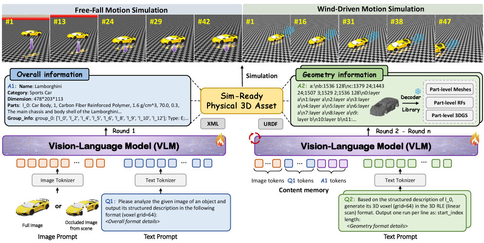
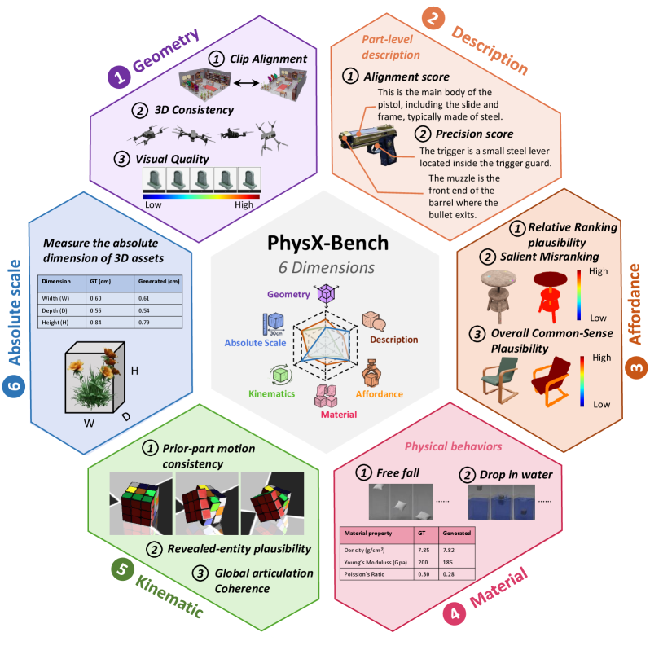
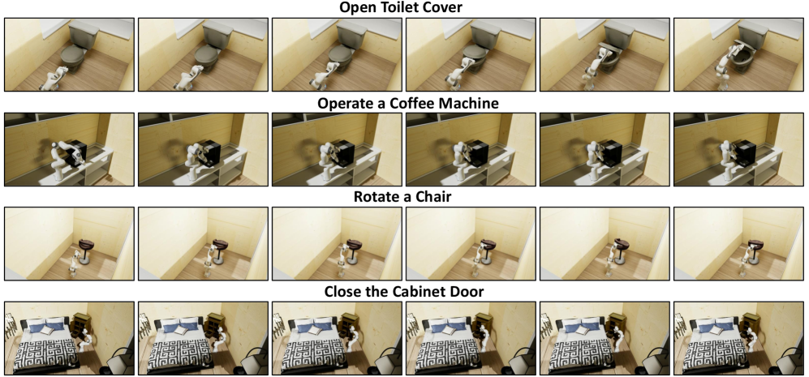

# PhysX-Omni 精读笔记

> **PhysX-Omni: Unified Simulation-Ready Physical 3D Generation for Rigid, Deformable, and Articulated Objects**
> Ziang Cao, Yinghao Liu, Haitian Li, ... Ziwei Liu（NTU S-Lab, ACE Robotics）
> arXiv: https://arxiv.org/abs/2605.21572 ｜ arXiv:2605.21572v1 [cs.CV] 2026-05-20
> 分组：物理仿真 / Simulation-ready 生成

---

## 核心思想

> PhysX-Omni 采用 **VLM 自回归框架**，按照“全局理解 → 部件级生成”的 coarse-to-fine 流程，从**单张图像**生成统一覆盖刚体、可形变物体和铰接物体的 simulation-ready 3D 资产。其核心创新是**模板化 RLE 文本几何表示（template-based RLE）**：先将体素沿轴向切分为二维掩码，再使用游程编码将其转换为文本 token，并利用相邻切片的结构冗余建立共享模板。该表示无需扩展 VLM 词表，也不依赖额外的网格分割模块。论文同时提出通用数据集 **PhysXVerse** 和无真值评测基准 **PhysX-Bench**。

相较于前作 **PhysX-Anything**，该方法以模板化 RLE 取代“粗体素生成后再分割”的流程，从而降低显式分割误差对最终几何质量的影响。

---

> **个人判断**：本文的主要价值不只在于指标提升，而在于构建了适用于刚体、可形变物体和铰接物体的统一文本几何表示，使 VLM 可以直接预测显式三维结构。当前不足是论文正文未明确说明最终采用的物理引擎；从工程闭环看，前作 [PhysX-Anything](07-PhysX-Anything.md) 提供了更明确的 URDF/MuJoCo 导出路径。

## 输入、输出与问题定义

### 输入

- 条件图像：单张完整或部分遮挡的 RGB 图像 \(I\)。
- 训练阶段附加监督：对象级与部件级层级结构、绝对尺度、材质、可供性、运动学参数、文本描述，以及部件级体素几何。

### 输出

模型输出 simulation-ready 资产

$$
\mathcal{A}
=
\left(
\mathcal{H},
\{\mathcal{G}_i,\mathcal{P}_i\}_{i=1}^{K}
\right),
$$

其中 \(\mathcal{H}\) 表示对象的层级结构，\(K\) 为部件数量，\(\mathcal{G}_i\) 为第 \(i\) 个部件的几何，\(\mathcal{P}_i\) 为对应物理属性。物理属性包括绝对尺度、材质、可供性、描述和运动学信息；运动学信息进一步包含关节类型、轴位置、轴方向和运动限位。

### 生成目标

给定图像 \(I\)，模型先生成全局表示 \(Y^{\mathrm{global}}\)，再逐部件生成局部表示 \(Y_i^{\mathrm{part}}\)。该过程可形式化为

$$
p(Y\mid I)
=
p\!\left(Y^{\mathrm{global}}\mid I\right)
\prod_{i=1}^{K}
p\!\left(Y_i^{\mathrm{part}}
\mid I,Y^{\mathrm{global}},Y_{<i}^{\mathrm{part}}\right).
$$

这一分解用于说明 global-to-local 自回归过程；论文未单独给出该概率公式。

## 符号与核心公式

### 1. 部件体素与二维切片

令第 \(i\) 个部件的二值体素为

$$
V_i\in\{0,1\}^{D\times H\times W},
$$

沿 \(z\) 轴得到切片 \(M_{i,z}=V_i[z,:,:]\)。每个切片中的连续占据区间使用游程集合表示：

$$
\operatorname{RLE}(M_{i,z})
=
\{(s_k,\ell_k)\}_{k=1}^{n_z},
$$

其中 \(s_k\) 和 \(\ell_k\) 分别表示第 \(k\) 个游程的起始位置与长度。

### 2. 模板匹配与无损残差

源码中，当前切片 \(R_z\) 与候选模板 \(T_j\) 的相似度定义为

$$
\operatorname{sim}(R_z,T_j)
=
\frac{|S(R_z)\cap S(T_j)|}
{\max\!\left(|S(R_z)|,|S(T_j)|\right)},
$$

其中 \(S(\cdot)\) 将 RLE 游程展开为占据位置集合。当最大相似度不低于阈值 \(0.90\) 时，只保存相对于模板的无损差异：

$$
\Delta_z^{+}=S(R_z)\setminus S(T_{j^\star}),\qquad
\Delta_z^{-}=S(T_{j^\star})\setminus S(R_z).
$$

因此切片可由模板、增量集合和删除集合精确恢复。上述相似度与阈值来自开源实现，是对论文“template layer + residual variation”的具体化。

## 核心机制图

### Fig.2 总体生成范式：单图 → 全局理解 → 多轮部件级生成

> 给定完整或部分遮挡的单张图，先推断高层全局信息（类别、语义、绝对尺度、部件层级、潜在物理属性），再用多轮(multi-turn)自回归生成逐部件的细粒度几何。全局/局部表示天然对齐，输出可直接组装成 sim-ready 资产。

### Fig.5 PhysX-Bench 六维评测

> 六个维度：geometry（结构+外观）、absolute scale、material、affordance、kinematics、description。

### Fig.11 在生成资产上做机器人操作（下游应用）

> 生成的 sim-ready 资产（几何 + 物理属性 + 铰接参数）直接导入物理仿真器做接触丰富的操作，无需额外手工处理。

---

## 方法细节（精读）

### 1) 生成范式：global-to-local 的 VLM 自回归
- 沿用 PhysX-3D[4] 的**树状、VLM 友好**表示，把对象级与部件级信息组织成层级结构，适配自回归视觉-语言建模。
- 第一步进行**整体理解**：预测类别、语义身份、绝对尺度、部件层级和物理属性，为后续部件生成提供结构与语义先验。
- 第二步**逐部件生成**：预测每个部件的几何结构 + 物理属性。

### 2) 关键创新：模板化 RLE 几何表示（Fig.3b）
> 解决"如何让 VLM 直接、高分辨率地表达 3D 几何，又不引入特殊 token/分割模块"。

流程：
1. 把 sim-ready 资产**体素化**，按标注结构拆成**部件级体素**；
2. 每个部件沿 **z 轴切片**成一串 2D 二值掩码；
3. 每个切片用 **2D 游程编码(RLE)** 压成文本 token；
4. **模板层（template layers）**：多个相邻切片共享结构模板，仅记录相对差异，从而减少重复 token。

该表示无需新增特殊 token，兼容现有 VLM 词表；显式几何结构也提高了对局部自回归误差的容忍度。生成体素可直接输入 **TRELLIS** 解码器得到网格，无需额外的网格分割或拓扑细化。

### 3) 训练配置
| 项 | 值 |
|---|---|
| VLM backbone | **Qwen2.5-VL-7B-Instruct** |
| 算力 | **64× A100，约 14 天**，5 epoch |
| 优化 | peak lr 2e-5，cosine + warmup 0.03，effective batch 128 |
| 最大序列长度 | **16,384 tokens** |
| 解码器 | **TRELLIS**（voxel → mesh） |
| 训练数据 | PhysXNet + PhysX-Mobility + PhysXVerse ≈ **42K 资产**，每物体渲 25 视角 |

---

## 结构化速记

| 字段 | 内容 |
|---|---|
| **Problem** | 现有 3D 生成重外观轻物理，或只覆盖单一类别（铰接/可形变其一）；sim-ready 数据稀缺；缺无 GT 的真实场景评测。 |
| **Input** | 单张图（可部分遮挡）。 |
| **Output** | 刚体/可形变/铰接统一的 sim-ready 物理 3D 资产（几何 + 六类物理属性 + 铰接参数）。 |
| **Representation** | 全局：树状 VLM 友好表示；几何：**模板化 RLE 文本表示**（体素切片→RLE→模板层）。 |
| **Physical properties** | geometry / absolute scale / material / affordance / kinematics / description。kinematics 包括**关节轴位置、关节方向、关节类型和运动限位**，与 URDF 的主要关节字段基本对应。 |
| **Simulator compatibility** | 资产带几何+物理+铰接参数可**直接导入物理仿真器**做接触丰富操作；论文称"common simulation environment / physics simulator"但**未点名具体引擎**。 |
| **Downstream use** | ① 机器人策略学习（Fig.11）；② sim-ready 场景生成（depth[45] + SAM2[33] 估布局 → 插入生成资产，Fig.12）。 |
| **Main contribution** | ① 统一框架 + 模板化 RLE 几何表示；② 数据集 **PhysXVerse**（8.7K 资产 / 2.9K 类 / 部件数 1–65）；③ 无 GT 基准 **PhysX-Bench**（Qwen3.5-122B 评测，六维，与人类 Spearman ρ 多达 1.0）。 |
| **关键指标** | PhysXVerse 上 CD 2.95、F-score 91.28、kinematic 0.9185、绝对尺度误差 **2.79**（PhysXGen 309 / PhysX-Anything 298）。 |
| **Limitations** | 高复杂结构/细粒度几何质量仍可提升；因重物理理解而非外观预训练，**在偏外观的几何指标(CLIP/视觉质量)略逊** MonoArt（后者纯靠 TRELLIS 几何管线但缺物理）。 |
| **与我的 Sim2Real 项目关系** | "带物理属性的 3D 生成"核心一环，可作仿真物体来源。与 [PhysForge](02-PhysForge.md) 对比：本文重"统一 RLE 几何 + 数据集/基准"，PhysForge 重"物理蓝图 + KVI"。铰接参数可对接 [PAct](03-PAct.md)。 |

---

## PhysX-Bench 评测基准细节

- **无 GT**：用渲染图/视频喂 VLM(Qwen3.5-122B-A10B) 评分，可在 in-the-wild 真实图上评。
- **material**：渲成**自由落体 + 水滴**仿真视频——落地行为反映杨氏模量/泊松比，水滴反映密度。把物理属性"可视化成行为"再评，更贴人类感知。
- **kinematics**：prior-part motion consistency（可见部件）+ revealed-entity plausibility（单视图看不见但运动中露出的部件）+ global articulation coherence，加权平均。
- **人类对齐**：absolute scale/affordance/material/description 的 Spearman ρ=1.0，kinematic ρ=1.0 (Pearson r=0.992)，geometry ρ=0.8。

---

## 读后追问（已回填 ✅ / 待核 ❓）

- ✅ **几何表示形式**：模板化 RLE 文本 token（体素切片 + 游程编码 + 模板层）。
- ✅ **三类物体是否统一**：是，统一表示 + global-to-local 范式，靠 PhysXVerse 多类别覆盖。
- ✅ **运动学能否导出仿真描述**：kinematics 直接含关节轴位置/方向/类型/限位 = URDF 关节参数。
- ⚠️ 论文正文未点名具体引擎；开源仓库中的 `mjcf_source/` 与 `convert_objects2scene.py` 表明其场景应用包含 MJCF/MuJoCo 导出路径。
- ❓ RLE 表示在极复杂拓扑（部件数→65）下的 token 长度与失败率。

---

## 机理 ↔ 代码对照（GitHub 实现）

> 仓库：https://github.com/physx-omni/PhysX-Omni （代码 + PhysXVerse 数据集 + PhysX-Bench **已开源**）
> 结构是编号脚本式 pipeline：`1vlm_demo.py → 2infer_geo.py → 3jsongen_update.py → decoder_each.py`。

### ① 模板化 RLE 几何表示 = `dataset/3generate_data_new_64_finetune_rle.py`
论文 Fig.3b 的机制可在 `runs_by_z_to_string_lossless()` 中对应到具体实现，并补充正文未报告的工程细节：
- **逐 z 切片 RLE**：每层占据区编码成 `(start, length)` 游程；**length==1 省略**（压缩）。
- **模板匹配**：`runs_similarity()` 用集合交并比 `|交|/max(|A|,|B|)` 算层间相似度；
- **阈值 0.90**（`similarity_threshold=0.90`，论文未给）：sim≥0.90 → 复用模板并存 **delta**：`z：layer a +[新增] -[删除]`（无损）；否则**新建模板** `a：<runs>`。
- 体素分辨率 **64³**（文件名 `_64`）；分隔符用**中文冒号 `：`**（占 token 的实现取巧）。
- 该实现与论文中的“模板层 + 残差”一致；源码表明 residual 是**无损集合差分**，而不是有损近似。

```python
# dataset/3generate_data_new_64_finetune_rle.py
def runs_similarity(r1, r2) -> float:          # 层间相似度 = 交集 / max(|A|,|B|)
    s1, s2 = _runs_set(r1), _runs_set(r2)
    return len(s1 & s2) / max(len(s1), len(s2))

def runs_by_z_to_string_lossless(runs_by_z, *, similarity_threshold=0.90, ...):
    templates, labels, layer_lines = [], [], []
    for z in range(D):
        r = np.asarray(runs_by_z[z], dtype=np.int64)     # 第 z 层的 RLE 游程
        best_i, best_sim = None, -1.0
        for i, t in enumerate(templates):                # 找最相似的已有模板
            sim = runs_similarity(r, t)
            if sim > best_sim: best_sim, best_i = sim, i
        if best_i is None or best_sim < similarity_threshold:   # < 0.90 → 新建模板
            label = _int_to_label(len(templates)); templates.append(r); labels.append(label)
            layer_lines.append(f"{z}{colon}layer {label}")      # 精确引用
        else:                                                   # ≥ 0.90 → 复用 + 无损 delta
            adds = _runs_set(r) - _runs_set(templates[best_i])  # 需新增的游程
            rems = _runs_set(templates[best_i]) - _runs_set(r)  # 需删除的游程
            layer_lines.append(f"{z}{colon}layer {labels[best_i]} +[{add_str}] -[{rem_str}]")
```
> 输出首先以 `a：<runs>` 定义模板，再使用 `0：layer a +[...]-[...]` 表示各切片。VLM 对该文本序列进行自回归预测。相较于前作 [PhysX-Anything](07-PhysX-Anything.md) 的线性区间合并，本文采用**逐层 RLE + 模板差分**。

### ② VLM 自回归 = `qwen-vl-finetune/`（Qwen2.5-VL 微调）→ ③ 解码 = `trellis/`
- `infer_geo.py` 生成 RLE 几何文本，`decoder_each.py` 调用 **TRELLIS** 体素解码器生成网格，与论文所述“无需额外分割模块”一致。

### ③ Sim-Ready 场景生成应用 = `applications_scene/`
- `1automatic_label_seg.py`(SAM) → `2image_inpainting.py` → `3vlm_filter.py` → `4layout_bbox.py`，对应论文 4.9 节（depth+seg→布局→插资产）。仓库另有 `mjcf_source/`、`convert_objects2scene.py`，指向 **MJCF** 场景导出（即 MuJoCo 系），可部分回答"对接哪个引擎"的 ❓。
