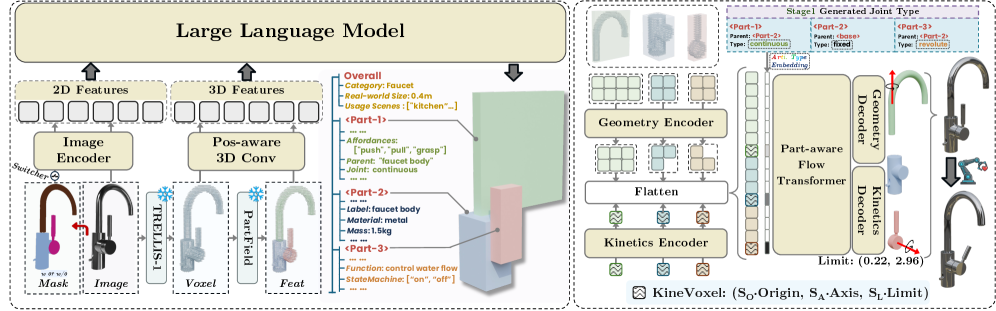
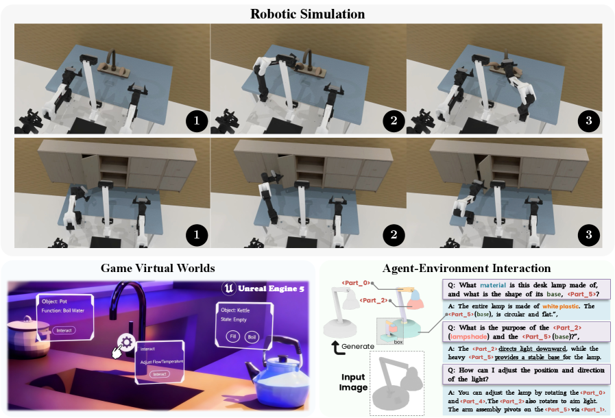

# PhysForge 精读笔记

> **PhysForge: Generating Physics-Grounded 3D Assets for Interactive Virtual World**
> Yunhan Yang, Chunshi Wang, Junliang Ye, ... Chunchao Guo, Xihui Liu（HKU / Tencent Hunyuan / ZJU / THU / SJTU / BUAA）
> arXiv: https://arxiv.org/abs/2605.05163 ｜ arXiv:2605.05163v1 [cs.CV] 2026-05-06
> 项目页：https://hku-mmlab.github.io/PhysForge/
> 分组：物理仿真 / Simulation-ready 生成

---

## 核心思想

> PhysForge 将“物理规划”与“几何和运动学实现”分为两个阶段。第一阶段微调 Qwen2.5-VL，使其根据单张图像、三维体素和可选二维掩码生成**分层物理蓝图**，其中包含部件包围盒、父子关系、关节类型、材质、功能和质量等属性。第二阶段使用扩散模型实现该蓝图，并通过 **KineVoxel Injection（KVI）** 将连续关节参数编码为运动学 latent，与几何 latent 在同一去噪过程中联合生成。

论文的关键动机是：VLM 适合进行高层结构与功能推理，但不擅长精确回归连续三维运动学参数；扩散模型则适合在连续潜空间中联合建模几何与运动学。

---

> **个人判断**：KVI 是本文最有代表性的设计。它将关节原点、轴方向和运动范围编码为与几何 latent 同域的表示，从而避免直接要求 VLM 输出高精度连续数值。物理属性对部件功能的约束也有助于缓解部件粒度歧义。需要注意的是，截至当前版本，核心训练代码尚未开源，因此有关 KVI 的实现细节仍只能依据论文正文分析。

## 输入、输出与问题定义

### 输入

第一阶段的条件输入为

$$
c=(I,V,M),
$$

其中 \(I\) 是单张 RGB 图像，\(V\) 是 TRELLIS 第一阶段得到的三维体素，\(M\) 是可选的二维部件掩码。掩码用于控制部件分解粒度，不是必需输入。

### 中间输出：分层物理蓝图

VLM 自回归生成蓝图

$$
\mathcal{B}
=
\{B_i,q_i,\tau_i,a_i^{\mathrm{static}},
a_i^{\mathrm{functional}},a_i^{\mathrm{interactive}}\}_{i=1}^{K},
$$

其中 \(B_i\) 为第 \(i\) 个部件的三维包围盒，\(q_i\) 为父部件，\(\tau_i\) 为关节类型，其余属性分别描述静态物理性质、功能和交互方式。

### 最终输出

第二阶段输出部件级几何、纹理和精确运动学参数：

$$
\widehat{\mathcal{A}}
=
\{\widehat{G}_i,\widehat{T}_i,
\widehat{O}_i,\widehat{A}_i,\widehat{L}_i\}_{i=1}^{K}.
$$

这里 \(G_i\) 和 \(T_i\) 表示几何与纹理；\(O_i\)、\(A_i\) 和 \(L_i\) 分别为关节原点、关节轴和运动限位。

上述蓝图与最终资产的集合写法是本笔记为统一输入输出而增加的形式化表达，并非论文原式；变量含义与论文定义一致。

## 符号与核心公式

### 1. KineVoxel 参数化

第 \(i\) 个部件的连续运动学参数写为

$$
P_i=(O_i,A_i,L_i),
\qquad
O_i\in\mathbb{R}^{3},\quad
A_i\in\mathbb{R}^{3},\quad
L_i\in\mathbb{R}^{2}.
$$

因此 \(P_i\) 是一个 8 维向量。论文先对各组参数进行尺度归一化，再使用两层 MLP 编码：

$$
z_{k,i}
=E_{\mathrm{kine}}
\!\left(
\operatorname{concat}
(S_O O_i,S_A A_i,S_L L_i)
\right).
$$

编码后的 \(z_{k,i}\) 与几何 latent \(Z_g=\{z_{g,i}\}\) 拼接，并加上由蓝图关节类型产生的 embedding \(E_{\mathrm{type}}\)，共同输入中间去噪 Transformer。

### 2. Conditional Flow Matching 目标

模型将几何和运动学 latent 的速度预测分别监督：

$$
\mathcal{L}
=
\mathbb{E}_{t,Z_0,c}
\left[
\mathcal{L}_{\mathrm{geo}}
+\lambda_{\mathrm{kine}}\mathcal{L}_{\mathrm{kine}}
\right],
$$

$$
\mathcal{L}_{\mathrm{geo}}
=\|v_{g,t}-\widehat{v}_{g,t}\|_2^2,
\qquad
\mathcal{L}_{\mathrm{kine}}
=\|v_{k,t}-\widehat{v}_{k,t}\|_2^2.
$$

论文设定 \(\lambda_{\mathrm{kine}}=10\)，使训练更重视精确关节参数。条件变量 \(c\) 来自第一阶段生成的物理蓝图。

## 核心机制图

### Fig.2 两阶段方法总览：VLM 规划蓝图 → 扩散 + KVI 联合生成

> 左：Stage 1 VLM Planner 输出"分层物理蓝图"（部件结构 + 物理属性）。右：Stage 2 扩散模型在蓝图引导下，用 KVI 协同生成几何、纹理、精确运动学参数。

### Fig.6 下游应用：机器人操作 / 虚拟世界 / 语言交互

> (a) 机械臂在 **RoboTwin** 仿真器里操作资产的功能部件；(b) 导入 **Unity/UE** 虚拟世界做基于物理的交互；(c) agent 用自然语言查询资产的物理蓝图来规划任务。

---

## 方法细节（精读）

### Stage 1 — VLM as Physical Blueprint Planner
- **Base**：Qwen2.5-VL 微调（保留世界知识 + 注入 3D 理解）。
- **输入**：单图 `I` + 3D 体素 `V`（取自 TRELLIS 第一阶段）+ 可选 2D mask `M`（控制粒度）。
- **3D 编码**：使用 PartField 编码器提取逐体素特征，再通过位置感知三维卷积下采样为 512 维 embedding，以保留局部部件信息。
- **bbox token 化**：新增 **66 个特殊 token**——`<boxs>`/`<boxe>` 界定 + 64 个量化坐标 token，**每个 3D AABB 只用 6 token**，高效。
- **输出**：分层物理蓝图（逐部件 bbox + 父子节点 + 关节类型 + 物理属性）。
- **关键发现**：physics-guided planning 可缓解部件粒度歧义。材质与功能的联合预测提供了更强的语义约束；即使不提供 mask，模型仍能产生合理的部件划分（Table 3 中 w/o mask 仍优于 OmniPart + SAM mask）。

### Stage 2 — Diffusion + KineVoxel Injection (KVI)
> VLM 负责高层结构与语义规划；精确的关节原点、轴向量和运动范围则由连续潜空间中的扩散模型预测。

- 单部件关节参数 = **8 维向量** `P_i = (O_i, A_i, L_i)`：`O_i∈R³` 关节原点、`A_i∈R³` 关节轴、`L_i∈R²` 运动限位。
- 运动学参数经两层 MLP 编码器 `E_kine` 映射为 KineVoxel latent `z_{k,i}`，并与几何 latent `Z_g` 共享中间表示空间。
- 在 OmniPart 第二阶段的下采样之后，将 `z_{k,i}` 与几何体素 latent 拼接并输入去噪 Transformer；由 VLM 预测的 joint-type embedding 用于区分 latent 类型并提供功能先验。
- 训练：**Conditional Flow Matching**，复合损失 `L = L_geo + λ_kine·L_kine`，**λ_kine=10**（更重视关节参数精度）。

### 数据集 PhysDB（四层物理标注）
- **15 万**资产，源自 **Objaverse**，七大类（家居/工业/武器/个人/车辆/科技电子/文化）。
- **四层标注**：
  1. **holistic**：真实尺度、类别、使用场景（厨房/卧室）；
  2. **static**：部件语义标签、物理材质（金属/木头）、质量；
  3. **functional**：内在功能（to contain/to control）+ 状态机（[open, closed]）；
  4. **interactive**：原子可供性(pushable/graspable) + 运动学定义（父部件、关节类型 revolute/continuous/prismatic/fixed、轴 origin/direction/limits）。
- **注意**：15 万规模下精确数值轴难标，PhysDB 只标关节**类型**；扩散阶段的**精确轴参数**靠 **PartNet-Mobility + Infinite-Mobility** 补充 GT 训练。

---

## 结构化速记

| 字段 | 内容 |
|---|---|
| **Problem** | 现有方法主要生成静态几何与纹理，缺少质量、功能、可供性和关节等交互所需属性，因而难以直接用于具身仿真或虚拟世界。 |
| **Input** | 单图（+ 可选 2D mask）。 |
| **Output** | 功能完整、物理可交互的 part-aware 3D 资产（几何 + 纹理 + 精确运动学参数 + 物理属性）。 |
| **Representation** | 分层物理蓝图（bbox 6-token 化）+ KineVoxel（8 维关节向量入扩散潜空间）。 |
| **Physical properties** | 四层：holistic / static(材质·质量) / functional(功能·状态机) / interactive(可供性·关节)。 |
| **Simulator compatibility** | 明确可进 **RoboTwin** 仿真器 + **Unity/UE** 虚拟世界。 |
| **Downstream use** | 机器人操作、游戏开发、语言驱动任务规划（查物理蓝图）。 |
| **Main contribution** | ① physics-grounded 生成的新范式 + 解耦两阶段框架；② 数据集 **PhysDB**(15 万 / 四层标注)；③ **KVI** 机制联合生成几何+运动学。 |
| **关键指标** | 关节 Joint-Axis-Err 0.101 / Pivot-Err 0.071（优于 Articulate-Anything 0.608/0.257、Singapo 0.241/0.153）；planning Bbox IoU 42.95（OmniPart 41.66）。 |
| **Limitations** | 论文未设独立 Limitation 节；可推断：PhysDB 缺精确数值轴需外部数据集补；依赖 TRELLIS/OmniPart 几何先验；VLM 蓝图错误会向 Stage 2 传导。 |
| **与我的 Sim2Real 项目关系** | 与 [PhysX-Omni](01-PhysX-Omni.md) 形成对照：PhysX-Omni 使用统一 RLE 文本几何和 VLM 自回归生成；PhysForge 将 VLM 规划与扩散实现解耦，并通过 KVI 连续生成关节参数。铰接对象的专项方法见 [PAct](03-PAct.md)。 |

---

## PhysX-Omni vs PhysForge 速辨

| | PhysX-Omni | PhysForge |
|---|---|---|
| 几何如何出 | VLM 自回归直接出（模板化 RLE 文本体素） | 扩散模型出（TRELLIS/OmniPart 路线） |
| 运动学如何出 | VLM 一并自回归预测 | **扩散头 KVI** 连续生成（VLM 只给类型） |
| 部件分解 | 树状层级表示 | VLM 规划 bbox（physics 辅助消歧） |
| 数据 | PhysXVerse 8.7K | PhysDB 150K + PartNet-Mobility/Infinite-Mobility |
| 点名引擎 | 未点名 | RoboTwin + Unity/UE |

---

## 核对结果与开放问题

- ✅ 四层标注具体内容 / KVI 注入的运动学量（origin/axis/limit 8 维）。
- ✅ 对接引擎：RoboTwin、Unity/UE。
- ❓ 两阶段 vs 端到端的误差累积量化（Stage1 bbox 错误对 Stage2 的影响未单列）。
- ❓ KVI 对多关节(>2)复杂物体的可扩展性。

---

## 机理 ↔ 代码对照（GitHub 实现）

> 仓库：https://github.com/hku-mmlab/PhysForge ｜ 项目页：https://hku-mmlab.github.io/PhysForge/ （**ICML 2026**）
> **代码状态**：截至本笔记版本，仓库 `main` 分支仅包含 `README.md` 与示意资源，KVI、PhysDB 和两阶段训练代码尚未发布，因而暂时无法进行代码级核验。
>
> 因此，下列实现细节仍需在代码发布后进一步核对：
> - `KineVoxel` 的 8 维 `(O,A,L)` 编码器/解码器（论文说是 2 层 MLP）、joint type embedding 注入点；
> - Stage1 的 66 个 bbox 特殊 token 实现、PartField 编码器接法；
> - λ_kine=10 的 Conditional Flow Matching 损失；
> - 是否提供导出到 **RoboTwin / Unity / UE** 的脚本（论文 Fig.6 应用）。
>
> 横向参考：PhysForge 与 [PAct](03-PAct.md) 均基于 TRELLIS/OmniPart，并采用生成模型结合关节回归的路线。由于 PAct 已开源，其关节回归实现可作为理解 PhysForge KVI 设计的工程参考，但不能等同于 PhysForge 的实际实现。
