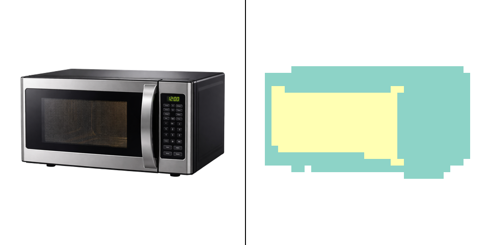
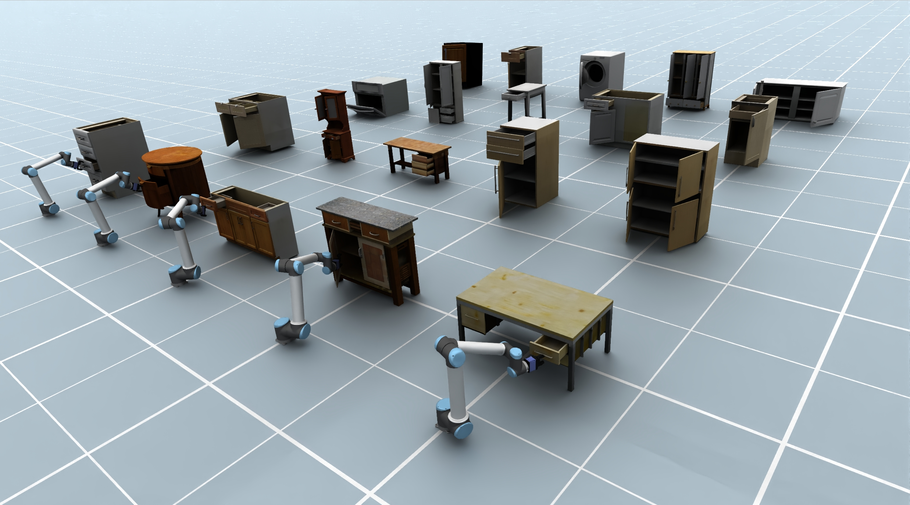
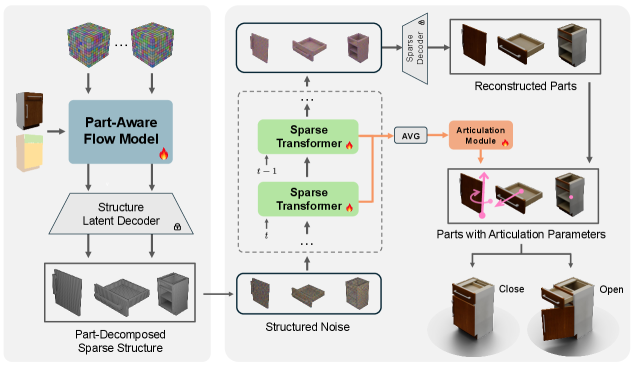
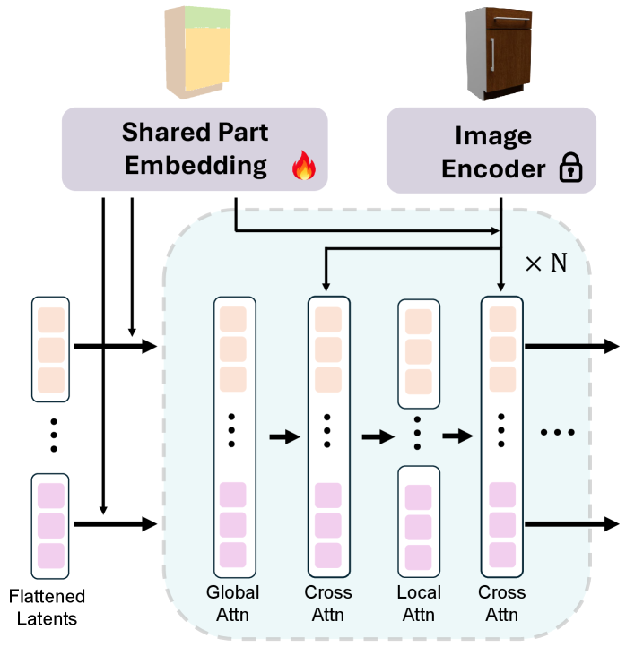
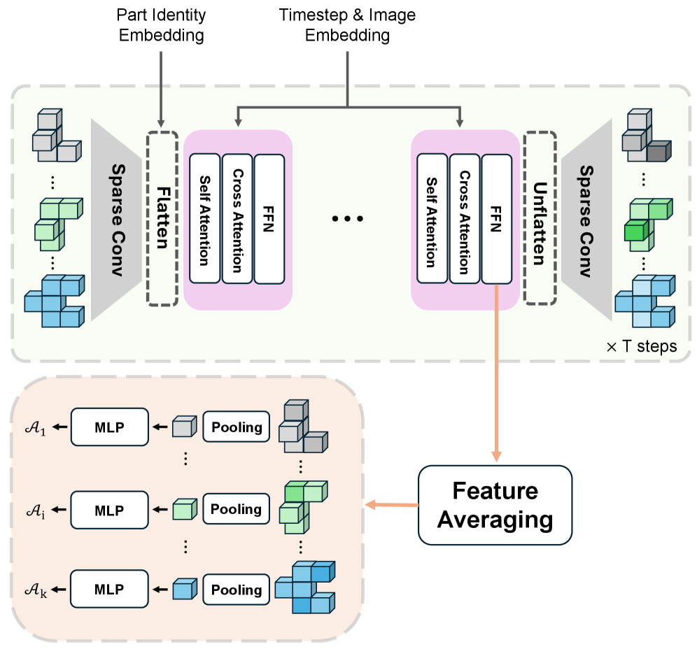

# PAct 精读笔记

> **PAct: Part-Decomposed Single-View Articulated Object Generation**
> arXiv: https://arxiv.org/abs/2602.14965 ｜ 项目页：https://PAct-project.github.io
> 分组：物理仿真 / Simulation-ready 生成（铰接对象）

---

## 核心思想

> PAct 在预训练 TRELLIS 的基础上进行微调，从单张图像生成部件分解的铰接物体。模型将每个部件表示为几何/外观与关节参数的组合，并在去噪 Transformer 中交替使用全局注意力与**部件内局部注意力**。关节参数不是由独立视觉网络预测，而是通过聚合多个去噪时间步的部件 token 特征，再由轻量 MLP 回归得到。

相较于逐实例优化或基于资产库的检索方法，PAct 采用前馈生成方式，强调输入实例的一致性、推理效率和部件级可控性。

---

> **个人判断**：本文最值得关注的是对去噪轨迹中间特征的再利用。Stage 2 的特征已同时编码部件几何、上下文和图像条件，因此可直接用于运动学回归，额外计算开销较小。其适用范围仍受简化运动学假设限制：模型主要处理 depth-1 关节树、可见部件和部件数量较少的常见家居物体。

## 本地复现实验

### 复现状态

2026 年 6 月 13 日，我在集群 `hive` 分区的一张 NVIDIA A100-SXM4-40GB 上完成了 PAct 开源推理流程的端到端验证。实验使用仓库提供的 Microwave 示例，包括一张 RGBA 条件图像及其部件分割掩码。运行过程依次完成：

1. 从本地目录加载 PAct 预训练权重；
2. 使用 DINOv2 ViT-L/14 提取图像条件特征；
3. 执行 Stage 1 部件稀疏结构采样；
4. 执行 Stage 2 结构化潜变量采样与关节参数回归；
5. 根据预测的部件和关节信息渲染关节运动动画与部件爆炸视图。

本次实验采用低步数配置验证完整的软件与模型链路：`ss_steps=2`、`slat_steps=2`、`arti_mean_num=2`、`render_num_frames=4`。两阶段采样均成功完成，程序正常退出，并生成静态图像和两段 MP4 动画。

### 复现结果



图中左侧为 Microwave 条件图像，右侧为 PAct 生成的部件爆炸视图。动态结果：

- [关节运动动画](figures/pact_reproduction_articulation.mp4)
- [部件爆炸视图动画](figures/pact_reproduction_exploded.mp4)

该结果表明，本地环境能够完整执行“图像与部件掩码输入 → 部件级三维生成 → 关节参数预测 → 动态可视化”的推理链路。由于这里只使用 2 个稀疏结构采样步和 2 个结构化潜变量采样步，实验目的主要是验证代码、权重和 CUDA 算子的可运行性，而不是复现论文中的最终生成质量或定量指标。

### 运行配置

| 项目 | 配置 |
|---|---|
| 计算节点 | `hive` 分区 |
| GPU | NVIDIA A100-SXM4-40GB |
| Python 环境 | Python 3.10；关键实测版本见 [`../environments/README.md`](../environments/README.md) |
| PAct 权重 | [`PAct000/PAct`](https://huggingface.co/PAct000/PAct) 的本地下载 |
| 图像编码器 | DINOv2 ViT-L/14 with registers |
| 稀疏卷积后端 | spconv |
| 注意力后端 | xFormers |
| 测试样本 | `Microwave_000_processed.png` + `Microwave_000_mask.exr` |
| 输出目录 | 上游 PAct 仓库中的 `outputs/smoke/` |

在克隆的 PAct 上游仓库中执行的核心推理命令为：

```bash
ATTN_BACKEND=xformers SPARSE_ATTN_BACKEND=xformers \
python infer_imgs.py \
  --model_path pretrain/PAct \
  --data_dir smoke_inputs \
  --outdir outputs/smoke \
  --batch_size 1 \
  --ss_steps 2 \
  --slat_steps 2 \
  --arti_mean_num 2 \
  --render_num_frames 4 \
  --no-save_video_grid \
  --no-save_cond_vis_grid
```

为保证开源代码在当前环境中稳定运行，本地复现还修正了三处工程问题：允许通过 `--model_path` 使用本地权重，使 `--data_dir` 参数实际生效；使用 OpenCV 显式读取 OpenEXR 部件掩码；使用多帧视频接口保存爆炸视图 MP4。这些修改不改变模型结构或推理算法。
完整环境、输入组织方式与兼容性修改记录见 [`reproductions/pact/README.md`](../reproductions/pact/README.md)。

## 输入、输出与问题定义

### 输入

- 必需输入：单张 RGB 图像 \(\mathcal{I}\)。
- 可选控制：二维部件掩码 \(\mathcal{M}\)，用于指定期望的部件分解方式。

### 输出

论文将铰接物体定义为

$$
\mathcal{O}=\{\mathcal{P}_i\}_{i=1}^{K},
\qquad
\mathcal{P}_i=(\mathcal{G}_i,\mathcal{A}_i),
$$

其中 \(K\) 为部件数，\(\mathcal{G}_i\) 表示第 \(i\) 个部件的几何与外观，\(\mathcal{A}_i\) 表示其关节信息。目标是使输出同时满足几何完整性、与输入图像的外观一致性以及运动学合理性。

## 符号与核心公式

### 1. 关节参数化

每个部件的关节表示为

$$
\mathcal{A}_i=
\{\tau_i,\mathbf{s}_i,\mathbf{o}_i,
\mathbf{u}_i,\boldsymbol{\rho}_i,\mathbf{q}_i\},
$$

其中 \(\tau_i\) 是关节类型，\(\mathbf{s}_i\) 是语义标签，\(\mathbf{o}_i\in\mathbb{R}^3\) 是关节原点，\(\mathbf{u}_i\in\mathbb{R}^3\) 是关节轴，\(\boldsymbol{\rho}_i=[\rho_i^{\min},\rho_i^{\max}]\) 是运动范围，\(\mathbf{q}_i\) 是父部件。轴方向归一化为

$$
\mathbf{u}_i\leftarrow
\frac{\mathbf{u}_i}{\|\mathbf{u}_i\|_2}.
$$

### 2. 部件内局部注意力

对第 \(i\) 个部件的 token \(\mathbf{z}_i\)，局部注意力仅允许同一部件内部的信息交互：

$$
\mathbf{H}_i
=
\mathbf{z}_i+
\operatorname{Attn}
\left(
\mathbf{z}_i\mathbf{W}_Q^p,
\mathbf{z}_i\mathbf{W}_K^p,
\mathbf{z}_i\mathbf{W}_V^p
\right),
$$

$$
\operatorname{Attn}(\mathbf{Q},\mathbf{K},\mathbf{V})
=
\operatorname{Softmax}
\left(\frac{\mathbf{Q}\mathbf{K}^{\top}}{\sqrt d}\right)
\mathbf{V}.
$$

保留的全局注意力层负责建模不同部件之间的装配关系。

### 3. 多时间步特征聚合与关节回归

令 \(\mathbf{H}_i^t\in\mathbb{R}^{L_i\times D}\) 为时间步 \(t\) 时第 \(i\) 个部件在最后一个 Transformer block 中的 token 特征。论文对选定时间步集合 \(\mathcal{T}\) 求平均：

$$
\overline{\mathbf{H}}_i
=
\frac{1}{|\mathcal{T}|}
\sum_{t\in\mathcal{T}}\mathbf{H}_i^t.
$$

随后在 token 维进行均值池化和最大池化：

$$
\overline{\mathbf{h}}_i
=
\left[
\operatorname{MeanPool}(\overline{\mathbf{H}}_i)
\,\|\,
\operatorname{MaxPool}(\overline{\mathbf{H}}_i)
\right]
\in\mathbb{R}^{2D},
$$

并由 MLP \(g_\phi\) 回归关节参数：

$$
\widehat{\mathcal{A}}_i
=g_\phi(\overline{\mathbf{h}}_i).
$$

### 4. 训练目标

Stage 2 联合优化 flow-matching 损失与关节回归损失：

$$
\mathcal{L}
=
\mathcal{L}_{\mathrm{fm}}
+\lambda\mathcal{L}_{\mathrm{art}},
\qquad
\mathcal{L}_{\mathrm{art}}
=
\sum_{i=1}^{K}
\|\widehat{\mathcal{A}}_i-\mathcal{A}_i\|_2^2.
$$

训练时每次只采样一个 flow 时间步，因此关节损失使用该时间步的单步特征；推理时则聚合最后 20 个去噪时间步。

## 核心机制图

### Fig.1 Teaser：单图 → 部件分解结构 + 部件几何/外观 + 关节参数


### Fig.2 总 Pipeline：Stage1 部件稀疏结构 → Stage2 细化 + 铰接预测

> Stage 1 由 Part-Aware Flow Model 从单张图像预测部件级稀疏结构；Stage 2 使用 sparse Transformer 细化三维部件，并由铰接模块聚合多时间步特征估计关节参数。最终输出由部件几何和关节描述共同组成。

### Fig.3 Stage 1 架构：within-part 局部注意力改造 TRELLIS

> 把原 TRELLIS 网络的一部分注意力层改成**部件内局部注意力**以适配多部件输入，再在目标数据集上微调。

### Fig.4 Stage 2：缓存去噪中间特征 → 池化 → MLP 回归关节

> 在部件 token 去噪过程中缓存若干时间步的中间特征；对每个部件先在时间维求平均，再沿 token 维进行池化，最后输入 MLP 预测关节参数。

---

## 方法细节（精读）

### 物体与关节参数化
- 物体 `O = {P_i}_{i=1..K}`，部件 `P_i = (G_i, A_i)`：`G_i` 几何+外观，`A_i` 铰接。
- 铰接 `A_i = {τ_i, s_i, o_i, u_i, ρ_i}`：
  - `τ_i` 关节类型（**revolute 铰链 / prismatic 滑动 / fixed**）
  - `s_i` 语义标签（base / door / drawer）
  - `o_i∈R³` 关节原点(pivot)、`u_i∈R³` 关节轴（归一化）、`ρ_i∈R²` 运动范围
  - `q_i` 父部件
- **简化**：把 fixed-joint 子件（把手/旋钮）**合并进父件**（不增自由度）；采用 **depth-1 铰接树**（所有可动部件直连单一固定 root=base），`q_i` 可确定性设定。覆盖多数家居铰接物。

### Stage 1 — Part-Aware Flow Model
- 沿用 TRELLIS：稀疏二值占据栅格 **64³** + VAE → 隐空间 rectified flow。
- 部件级隐码 `Z_global = {z_i}` + **可学习 part-identity embedding**（`E∈R^{T×d_p}`，T 为最大部件数），拼接后区分部件。
- **改造注意力**：一部分层做 **within-part 局部注意力**（复用 TRELLIS 物体级建模到部件级），其余保持 global attention 捕捉部件间交互。

### Stage 2 — 部件条件生成 + 铰接回归
- 把各部件稀疏结构隐码 flatten 成 1D token，加位置编码 + **part embedding**（与 Stage1 的 identity embedding 不同），拼成全局 object token 序列做物体级去噪；**冻结的 TRELLIS SLAT 解码器**重建逐部件几何。
- **铰接回归**：聚合最后 `S` 个去噪时间步的 token 特征 `H_i^t`，先在时间维求平均，再进行 mean/max pooling，最后由六层 MLP `g_φ` 回归 `{τ, s, o, u, ρ}`。该模块相对于主干生成网络只引入较小的额外计算开销。
- 训练：`L = L_fm + λ·L_art`（L_art 为 ℓ₂）。**4× A800，40K 步，lr 1e-4，batch 32**；Stage1 初始化自 TRELLIS-stage1，Stage2 初始化自 OmniPart-stage2，分开训练。

---

## 结构化速记

| 字段 | 内容 |
|---|---|
| **Problem** | 铰接资产难规模化：优化/蒸馏类每实例几十分钟~数小时且 ill-posed；检索类不匹配输入外观/结构；从零训的重建模型数据少泛化差。 |
| **Input** | 单张 RGB 图。 |
| **Output** | 铰接 3D 物体：逐部件几何/外观 + 关节参数（类型/轴/pivot/范围/父子），可直接物理仿真。 |
| **Representation** | 部件级 latent（+identity embedding）；铰接参数从去噪特征回归。 |
| **Physical properties** | 纯**运动学/铰接**（revolute/prismatic/fixed + 轴/pivot/限位），不含材质/质量。 |
| **Simulator compatibility** | 关节参数 = URDF 风格，面向具身仿真/VR/AR；论文未点名具体引擎。 |
| **Downstream use** | 具身交互、机器人操作；常见铰接类（抽屉/门/柜）。 |
| **Main contribution** | ① 部件中心前馈框架，复用 TRELLIS 先验，免逐实例优化；② within-part 注意力改造；③ 多步去噪特征聚合回归关节，几乎零开销；④ 在 PartNet-Mobility/ACD 等上优于优化类与检索类基线，且推理快得多。 |
| **Limitations（明确给出）** | ① **多部件难扩展**（>8 铰链部件的物体在基准里稀少，监督不足）；② **不可见/被遮挡部件**（闭合柜门后的抽屉）推不出；③ **仅浅层树结构**，闭链/共享约束需显式图约束。 |
| **与我的 Sim2Real 项目关系** | 给仿真提供"铰接物体"这一难点类别。三种思路对照：[PhysX-Omni](01-PhysX-Omni.md) 统一多类、[PhysForge](02-PhysForge.md) VLM 规划+KVI、PAct 专铰接+去噪特征回归。 |

---

## 核对结果与开放问题

- ✅ 关节类型/参数：revolute/prismatic/fixed + 轴 u、pivot o、范围 ρ、父 q、语义 s。
- ✅ 单视图歧义/遮挡：明确列为 Limitation，假设所有部件可见，遮挡部件会失败。
- ✅ 多关节处理：depth-1 树，>8 部件难扩展（数据偏置 + 模型容量）。
- ✅ **URDF 导出**：开源仓库提供 `scripts/json_to_urdf.py`、批量转换脚本和可下载的 URDF 资源包。
- ❓ 与 PhysForge KVI 的定量对比（两者都基于 TRELLIS/OmniPart，但未互相比较）。

---

## 机理 ↔ 代码对照（GitHub 实现）

> 仓库：https://github.com/pact-project/PAct （代码 + Gradio demo `app.py` **已开源**）
> 目录 `modules/pact/` 基本是 **TRELLIS 的镜像改造**（models/modules/pipelines/datasets），印证"微调 TRELLIS"。

### ① within-part 局部注意力 = `modules/pact/modules/attention/modules.py` + `transformer/modulated.py`
- 注意力模块带 **`window_size`** 参数（TRELLIS 的 windowed/serialized attention），论文"把一部分注意力层改成部件内局部注意力"在代码里就是**按 part 设 window** 复用 TRELLIS 的窗口注意力实现，而非新写一套。

### ② 关节回归 = `pipelines/pact_i23d_gen_pipe.py` 的 `arti_out_mode`
- 代码暴露三种关节输出模式：**`diffusion_head_feature_cache`**（论文主推：缓存去噪中间特征）、`flow_matching`、`regression_last_step`（消融用单步特征）。
- `feature_cache` 分支对应多时间步特征聚合；`regression_last_step` 分支对应仅使用单个时间步特征的消融设置。

```python
# modules/pact/pipelines/pact_i23d_gen_pipe.py —— 多步去噪特征聚合 (默认取末 arti_mean_num=20 步)
def average_dict_datasets(dict_list):
    outs = []
    arti_mean_num = min(self.arti_mean_num, len(dict_list))        # = 20
    for dict_feats in dict_list[-arti_mean_num:]:                  # 只取最后 N 个去噪步
        outs.append(dict_feats["transformer_blocks"][-1])         # 最后一个 transformer block 的特征
    stacked   = torch.stack(outs, dim=0)
    avg_feats = torch.mean(stacked, dim=0)                        # 跨时间步平均 = 论文 H̄_i
    return {"transformer_blocks": [None]*(...) + [avg_feats]}
```
> 该实现与论文公式 (7) 一致，并进一步表明默认集合 `T` 取最后 20 个去噪时间步；聚合后再执行 mean/max pooling，并输入六层 MLP `g_φ`。

### ③ 关节参数化 = `modules/utils/articulation_utils.py`
- 关节类型映射 **`{fixed:1, revolute:2, prismatic:3, screw:4, continuous:5}`**——**代码支持 5 种**，比论文正文写的 3 种(revolute/prismatic/fixed) **多了 screw / continuous**。

```python
# modules/utils/articulation_utils.py
joint_ref = {
    "fwd": {"fixed": 1, "revolute": 2, "prismatic": 3, "screw": 4, "continuous": 5},
    "bwd": {1: "fixed", 2: "revolute", 3: "prismatic", 4: "screw", 5: "continuous"},
}
```
- 含 axis direction / origin 投影处理（`is_axis_o_projection`、revolute 轴投影），对应 `A_i = {τ,s,o,u,ρ,q}` 的几何后处理。

### ④ URDF 导出 = `scripts/json_to_urdf.py`
- 文件头注释：*"convert OmniPart articulation JSON files into URDF descriptions"*，确证 **PAct 产物可直接导出 URDF**；另有 `scripts/batch_json_to_urdf.py`（批量）、`scripts/animate_articulated.py`（关节动画验证）。
- 该工具确认 PAct 结果可导出为 URDF，并包含 `mass`、`limit_effort` 和 `limit_velocity` 等仿真字段（参见 `app_utils.py`）。
