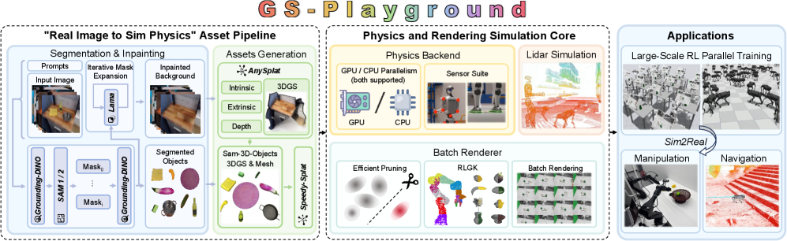
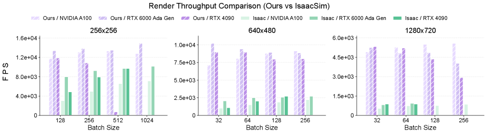
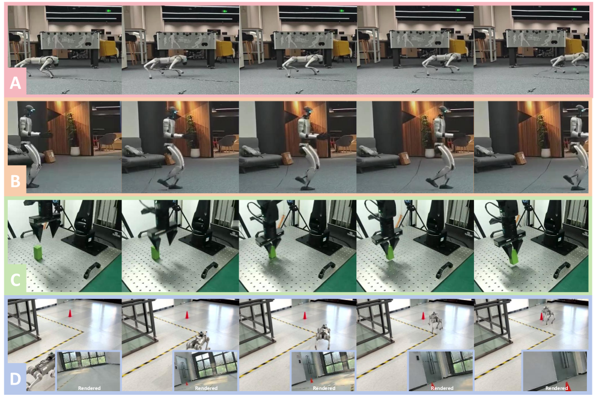

# GS-Playground 精读笔记

> **GS-Playground: A High-Throughput Photorealistic Simulator for Vision-Informed Robot Learning**
> arXiv: https://arxiv.org/abs/2604.25459
> 分组：机器人学习 + 重建 / Real-to-Sim

---

## 核心思想

> GS-Playground 将并行刚体物理、批量 3D Gaussian Splatting 渲染和自动 Real2Sim 重建整合为视觉机器人学习平台。系统使用速度-冲量约束求解器推进物理状态，通过点剪枝降低批量 3DGS 的显存开销，并提出 **Rigid-Link Gaussian Kinematics（RLGK）**，将高斯簇绑定到刚体 link，使视觉表示随低维刚体状态同步更新。自动 Image-to-Physics 流程进一步将单张 RGB 图像转换为包含 3DGS、碰撞网格、位姿和相机参数的仿真场景。

论文报告在单卡、2048 个并行场景和 \(640\times480\) 分辨率下达到约 \(10^4\) FPS，并在 locomotion、navigation 和 manipulation 任务上验证 Sim2Real 迁移。

---

> **个人判断**：从开源仓库看，可直接核验的部分主要是批量 3DGS 渲染、点剪枝、RLGK 和 MJCF 接口；物理求解器内核封装在 MotrixSim 包中，Real2Sim 的完整训练与物理属性估计流程也未全部开放。因此，应区分论文描述的完整系统与仓库中实际可复现的模块。

## 输入、输出与问题定义

### Real2Sim 输入与输出

- 输入：单张场景 RGB 图像 \(I\)。
- 中间结果：实例掩码 \(M_i\)、背景深度 \(D_{\mathrm{bg}}\)、对象深度 \(D_{\mathrm{obj},i}\)、对象网格、对象与背景 3DGS，以及相机内外参。
- 输出：可用于并行机器人学习的场景

$$
\mathcal{S}
=
\left(
\mathcal{G}_{\mathrm{bg}},
\{\mathcal{G}_i,\mathcal{M}_i,\mathbf{T}_i\}_{i=1}^{K},
\mathcal{C}
\right),
$$

其中 \(\mathcal{G}\) 表示高斯视觉资产，\(\mathcal{M}_i\) 表示碰撞网格，\(\mathbf{T}_i\in SE(3)\) 表示对象位姿，\(\mathcal{C}\) 表示相机标定信息。

上述场景元组是本笔记为说明系统接口而增加的统一形式化，不是论文中的原始公式。

### 仿真闭环输入与输出

物理引擎接收当前广义状态 \((\mathbf{q},\mathbf{v})\)、控制量和接触约束，输出下一时刻刚体状态；RLGK 将刚体状态映射到高斯位置与旋转；渲染器输出 RGB/深度观测供策略 \(\pi(a_t\mid o_t)\) 使用。

## 符号与核心公式

### 1. 速度-冲量动力学

在时间步长 \(h\) 下，论文使用

$$
\mathbf{M}(\mathbf{v}^{+}-\mathbf{v})
=
\mathbf{J}_e^{\top}\boldsymbol{\lambda}_e^{+}
+\mathbf{J}_n^{\top}\boldsymbol{\lambda}_n^{+}
+h(\boldsymbol{\tau}_{\mathrm{ext}}-\mathbf{c}),
$$

其中 \(\mathbf{M}\) 是质量矩阵，\(\mathbf{J}_e\) 和 \(\mathbf{J}_n\) 分别是等式与不等式约束 Jacobian，\(\boldsymbol{\lambda}\) 是约束冲量，\(\mathbf{c}\) 包含科里奥利力和离心力。

消去等式约束后，不等式约束空间中的速度满足

$$
\mathbf{u}_n^{+}
=
\mathbf{A}\boldsymbol{\lambda}_n^{+}+\mathbf{b}.
$$

接触和摩擦被写为混合互补问题。法向冲量满足 \([0,\infty)\) 约束，切向摩擦冲量满足库仑摩擦界：

$$
-\mu\lambda_{\perp}^{+}
\leq
\lambda_{\parallel}^{+}
\leq
\mu\lambda_{\perp}^{+}.
$$

系统使用 Projected Gauss-Seidel 求解，并以上一帧收敛冲量 \(\lambda_{t-1}\) 作为 warm start。

### 2. Rigid-Link Gaussian Kinematics

第 \(i\) 个高斯被绑定到刚体 \(k_i\)，其局部位置和局部四元数为 \((p_{\mathrm{local}}^i,q_{\mathrm{local}}^i)\)。在第 \(j\) 个并行环境中，全局状态为

$$
p_{\mathrm{world}}^{(j,i)}
=
R(q_{k_i}^{(j,t)})p_{\mathrm{local}}^i
+t_{k_i}^{(j,t)},
$$

$$
q_{\mathrm{world}}^{(j,i)}
=
q_{k_i}^{(j,t)}\otimes q_{\mathrm{local}}^i.
$$

该映射将每个环境中少量刚体位姿广播到约百万级高斯，从而避免逐高斯运行物理仿真。

## 核心机制图

### Fig.1 系统架构（三层）

> 左：自动 Image-to-Physics 流程，包括对象分割、背景修复、3DGS/mesh 重建和 simulation-ready 资产构建。中：物理与渲染仿真内核，包括 CPU/GPU 物理后端、传感器、批量 3DGS 渲染、点剪枝和 rigid-link 运动学。右：机器人操作、导航和大规模并行强化学习等下游应用。

### Fig.4 渲染吞吐对比（vs Isaac Sim 光追）

> 在 RTX 4090、RTX 6000 Ada 和 A100 上，GS-Playground 均表现出更高的批量渲染吞吐；Isaac Sim 光线追踪在高分辨率（1280×720）和大 batch 条件下更容易出现显存不足。

### Fig.7 真机 Sim2Real 部署

> (a) Go2 四足速度跟踪；(b) G1 人形 23-DoF 平衡行走；(c) RGB 端到端抓取；(d) Go2 纯 RGB 视觉导航（跟锥桶）。

---

## 方法/系统细节（精读）

### 三层架构 + 仿真闭环
1. **并行物理引擎**（GPU/CPU 双后端，跨 Win/Linux/macOS）：
   - **速度-冲量(velocity-impulse)** 公式推进世界状态；用 **Schur 补**消去等式约束 → 不等式约束 LCP。
   - **Constraint Islands**：每步建约束依赖图，把刚体系统划成互不耦合的"约束岛"，各自 LCP 独立 → 多核 CPU 并行，复杂度线性扩展。
   - **Warm-Starting**（Contact Manifold Tracking）：用上一帧收敛冲量 `λ_{t-1}` 初始化 PGS 求解器 → **PGS 迭代从 >50 降到 <10**。
   - **MJCF 兼容 API**（"零摩擦"迁移 MuJoCo 项目）；接触信息对标 MuJoCo（多点力/力矩/法向切向分解）。
2. **批量 3DGS 渲染器**：
   - **点剪枝**：高斯数减 **>90%**（仅留 ~30%），PSNR 掉 <0.05，视觉策略几乎无感。
   - **吞吐**：单卡渲 **2048 个 640×480 场景 = 10⁴ FPS**。
3. **Real2Sim（Image-to-Physics）流程**：
   - 检测 **Grounding DINO** → 分割 **SAM1/SAM2**（按 mask IoU 去重 + 双准则纠正过分割）；
   - 背景 **LaMa** 顺序 inpainting（逐个移除物体、重检测露出区域）；
   - 物体级：**SAM-3D** 从 RGB+mask 重建 3DGS+mesh、估 pose/scale；
   - 场景级：**AnySplat** 出背景 3DGS + 深度 + 相机内外参；
   - 对齐：物体渲染深度 `D_obj` 对齐背景深度 `D_bg`，再按 mask 像素占比缩放（亚毫米 pose 对齐）。
   - 速度：单图 ~5 min 端到端（RTX 3090）；分割+inpaint ~25s、AnySplat ~8s、SAM3D ~10s/物体。产出 **Bridge-GS** 数据集。

### 同步机制 RLGK
> **Rigid-Link Gaussian Kinematics**：将 3D 高斯簇绑定到物理引擎中的刚体 link，使视觉表示与刚体位姿同步更新，并避免在快速运动和接触过程中重新优化高斯。

---

## 结构化速记

| 字段 | 内容 |
|---|---|
| **Problem** | 视觉机器人学习两瓶颈：① 大规模照片级渲染算力贵（与 RL 抢资源、OOM）；② sim-ready 资产靠手工建模、接触丰富操作 sim2real gap 大。 |
| **Input** | 单张 RGB（Real2Sim）→ 真实场景数字孪生。 |
| **Output** | 照片级 + 物理一致的仿真环境（3DGS + mesh + pose + 物理属性），供视觉 RL。 |
| **Representation** | 3DGS（渲染） + 刚体物理；RLGK 绑定二者。 |
| **Physical properties** | 刚体动力学、多点接触力/力矩；接触信息对标 MuJoCo。 |
| **Simulator compatibility** | **本身是仿真器**；MJCF 兼容、对标 MuJoCo / 对比 Isaac Sim、Genesis/MjWarp。 |
| **Robot task** | 四足/人形 locomotion、视觉导航、接触丰富 manipulation（state-based + vision-based RL）。 |
| **Main contribution** | ① 并行物理引擎(Constraint Islands + warm-start)；② 显存高效批量 3DGS(点剪枝) 达 10⁴ FPS；③ 自动 Real2Sim(Image-to-Physics)；④ RLGK 零开销同步。 |
| **关键指标** | N=50 人形：1015 FPS（**32× MuJoCo、~600× MjWarp**）；Airbot RGB 抓取**零样本 90% 成功**（无简化背景/光照）；剪枝留 30% 高斯 PSNR/SSIM 几乎不掉。 |
| **Limitations（明确）** | ① 3DGS **难处理随机光照/阴影**，资产外观绑定源图光照，需算法 relighting；② **RLGK 假设刚体**，可形变/软体(布料/流体)难，计划接 PBD/MPM + 高斯。 |
| **与我的 Sim2Real 项目关系** | 该工作直接研究在重建环境中开展视觉机器人学习。它与 [LiteReality](05-LiteReality.md) 互补：本文强调照片级 3DGS 与高吞吐 RL，LiteReality 强调结构化、可编辑的对象资产。生成方法可用于补充重建场景中缺失的可交互物体。 |

---

## 核对结果与开放问题

- ⚠️ **物理引擎实现**：论文给出速度-冲量 MCP、Constraint Islands 与 warm start 的完整公式；开源仓库通过闭源依赖 `motrixsim_core` 调用该能力，未包含求解器源码。
- ✅ 10⁴ FPS 是 batch（2048 场景）总吞吐，单卡。
- ✅ 3DGS 物理几何来源：Real2Sim 同时出 mesh（SAM-3D）做碰撞，3DGS 仅做视觉。
- ✅ Sim2Real 成功率：Airbot 抓取零样本 90%。
- ❓ 接触丰富操作的更大规模/更多物体类别基准（目前 manipulation 偏抓取）。
- ❓ Real2Sim 的物理属性（质量/摩擦）从哪估、精度如何（论文重几何+pose，物理属性估计着墨少）。

---

## 机理 ↔ 代码对照（GitHub 实现）

> 仓库：https://github.com/discoverse-dev/gs_playground （**RSS 2026**）
> ⚠️ **重要修正**：`pyproject.toml` 自述为 *"Unified **MotrixSim** 3D Gaussian rendering demos and benchmark notebooks"*。

### ① 物理引擎 = MotrixSim（**不是论文读起来的"完全从零自研"**）
- 依赖 **`motrixsim_core==0.7.1.dev97295`**（来自 `pypi.motphys.com`，闭源商业包）+ `gaussian_renderer==0.2.0` + `gsplat==1.5.3`。
- 论文所述 `ground-up custom parallel physics engine` 在发布仓库中通过 **MotrixSim** 提供；仓库主要包含 demo、benchmark 和剪枝脚本，不包含求解器源码及完整 Real2Sim 训练流程。

### ② RLGK（高斯-刚体绑定）= `demo/live_demo/replay.py`
- `import motrixsim as mx` + `from motrixsim import forward_kinematic` + `from gaussian_renderer import MtxBatchSplatRenderer`。
- 机制落地：用 MotrixSim 的 **forward kinematic** 取各 body/link 的 pose（四元数 `quat_xyzw_to_matrix`/`matrix_to_quat_wxyz`），把高斯簇按 link 变换刷新——即论文 RLGK"零开销同步"；场景用 **MJCF `<worldbody><body>`** 定义（印证 MJCF 兼容）。

```python
# demo/live_demo/replay.py —— RLGK 的实际帧循环
def render_gs_frame(gs_renderer, bg_renderer, bg_imgs, model, data, cam_id, height, width):
    forward_kinematic(model, data)                 # ① 物理引擎前向运动学，更新各 link pose
    link_poses = model.get_link_poses(data)
    body_pos  = link_poses[..., :3]                # 平移
    body_quat = link_poses[..., 3:7]               # 四元数
    ...
    gsb = gs_renderer.batch_update_gaussians(body_pos, body_quat)   # ② 高斯簇按 link pose 刚体变换
    rgb_t, _ = gs_renderer.batch_env_render(gsb, cam_pos_t, cam_xmat_t, ..., bg_imgs=bg_imgs)  # ③ 批量渲染
```
> 该代码对应 RLGK：每帧先取得物理 link 位姿，再以批量刚体变换更新高斯簇。`batch_*` 接口进一步验证了并行渲染设计。

### ③ 点剪枝 = `benchmark/scripts/prune_gaussians.py`
- 打分模式 `opacity` / `opacity_area` / `opacity_volume`，按 **`keep_ratio`** 保留高斯——对应论文"剪 >90%、留 ~30%、PSNR 掉 <0.05"。

```python
# benchmark/scripts/prune_gaussians.py
def gaussian_importance(g, mode):
    opacity = np.asarray(g.opacity).reshape(-1)
    if mode == "opacity":         return opacity
    if mode == "opacity_area":                       # 不透明度 × 投影面积(次大两个 scale 之积)
        s = np.sort(np.maximum(g.scale, 1e-8), axis=1); return opacity * s[:,1]*s[:,2]
    if mode == "opacity_volume":  return opacity * np.prod(np.maximum(g.scale,1e-8), axis=1)

def prune_file(src, dst, keep_ratio, keep_count, mode):
    g = load_ply(src)
    keep_count = int(round(len(g) * keep_ratio))     # e.g. keep_ratio=0.3 → 留 30%
    score = gaussian_importance(g, mode)
    keep_idx = np.argpartition(score, -keep_count)[-keep_count:]   # 取分数最高的 keep_count 个
    save_ply(subset_gaussians(g, keep_idx), dst)
```

> **代码核对结论**：仓库能够验证批量 3DGS、点剪枝、RLGK 和 MJCF 接口；Constraint Islands、warm start 和 MCP 求解器封装在 MotrixSim 依赖中，无法从当前仓库核验。Real2Sim 中质量与摩擦等物理属性的估计模块也未公开。
