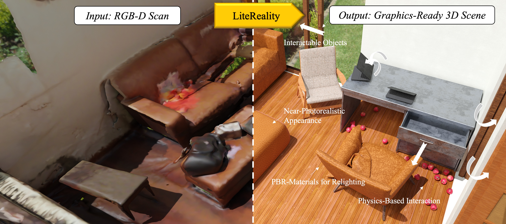
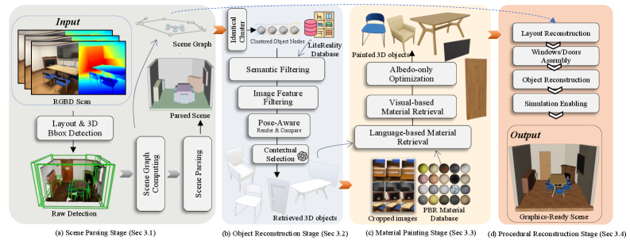
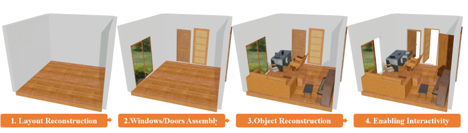
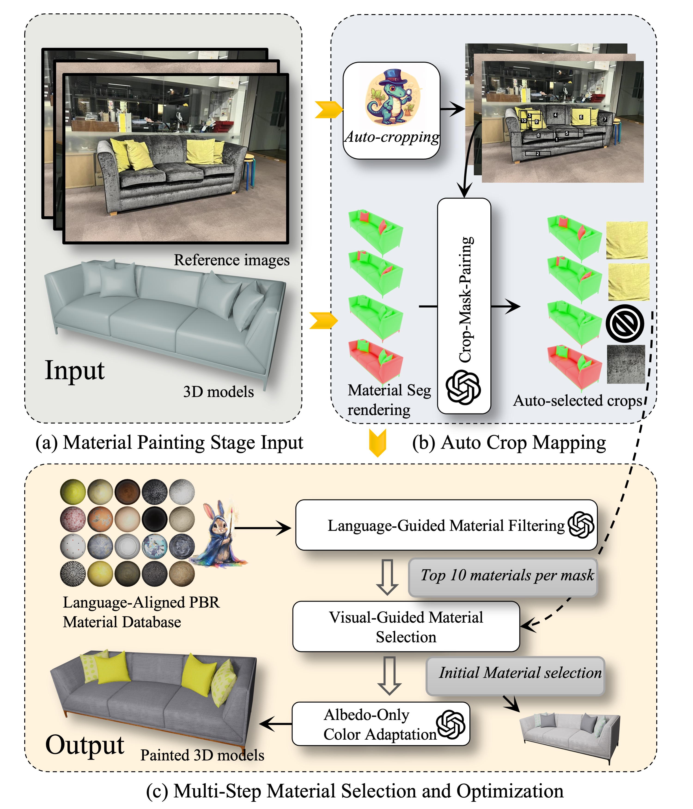

# LiteReality 精读笔记

> **LiteReality: Graphics-Ready 3D Scene Reconstruction from RGB-D Scans**
> University of Cambridge / The University of Hong Kong / TU Munich
> arXiv: https://arxiv.org/abs/2507.02861 ｜ v3
> 分组：Graphics-ready 3D 重建

---

## 核心思想

> LiteReality 将室内 RGB-D 扫描转换为紧凑、可编辑且可交互的 graphics-ready 场景。系统包括四个阶段：场景感知与解析、基于美术资产库的免训练分层检索、PBR 材质恢复，以及 Blender 中的程序化场景组装。与直接重建扫描网格不同，LiteReality 使用结构清晰的 CAD 资产替换观测中的对象，并通过场景图、材质分配、质量估计和刚体设置补充图形与交互属性。

该方法的目标不是获得纯粹的视图合成表示，而是输出由独立对象、显式几何、PBR 材质和基础物理属性构成的标准图形资产。

---

> **个人判断**：检索式重建为场景编辑、资源复用和物理交互提供了清晰结构，工程可用性较强；其主要限制是结果受资产库覆盖率和上游检测质量约束。当前实现最终生成 Blender 场景，尚未提供直接导出 USD、URDF 或 MJCF 的完整路径，因此接入机器人仿真器仍需要额外转换。

## 输入、输出与问题定义

### 输入

输入为室内 RGB-D 序列

$$
\mathcal{D}=\{(I_t,D_t,\mathbf{K},\mathbf{T}_t)\}_{t=1}^{N},
$$

其中 \(I_t\) 和 \(D_t\) 分别为第 \(t\) 帧的 RGB 图像与深度图，\(\mathbf{K}\) 为相机内参，\(\mathbf{T}_t\) 为相机位姿。RoomPlan 或替代方法还提供房间布局与对象朝向包围盒。

### 中间表示

场景图记为

$$
\mathcal{G}=(\mathcal{V},\mathcal{E}),
$$

节点包含墙、门窗和对象。对象节点的空间属性为中心 \(\mathbf{C}\in\mathbb{R}^3\)、尺寸 \(\mathbf{D}\in\mathbb{R}^3\) 和朝向 \(\boldsymbol{\theta}\in\mathbb{R}^3\)；边表示 wall-attached、on-top、table-chair pair 和 connecting-to 等空间关系。

### 输出

最终输出为对象中心的 graphics-ready 场景：

$$
\widehat{\mathcal{S}}
=
\{\widehat{O}_i,\widehat{T}_i,
\widehat{M}_i,\widehat{P}_i\}_{i=1}^{K}
\cup \widehat{L},
$$

其中 \(\widehat{O}_i\) 是检索到的 CAD 对象，\(\widehat{T}_i\) 是位姿，\(\widehat{M}_i\) 是 PBR 材质，\(\widehat{P}_i\) 是质量、碰撞和刚体等物理属性，\(\widehat{L}\) 是房间布局。

输入序列、场景图和最终场景的集合写法是本笔记为统一说明接口而增加的形式化表达，并非论文原式。

## 符号与核心公式

### 1. Albedo-only 颜色校正

令 \(\mathbf{S}(p)\in\mathbb{R}^3\) 为源 albedo 在像素 \(p\) 处的 CIE LAB 值，\(\mathbf{T}\in\mathbb{R}^3\) 为多视角参考图像推断出的目标 LAB 颜色，\(P\) 为 albedo 像素集合。调整后的颜色为

$$
\mathbf{S}'(p)
=
\mathbf{S}(p) +
\left(
\mathbf{T}
-
\frac{1}{|P|}\sum_{q\in P}\mathbf{S}(q)
\right).
$$

该变换只平移全局颜色均值，因此能够修正亮度与色调，同时保留纹理中的局部高频变化。

### 2. 检索评测中的双向 L1 Chamfer Distance

对归一化后的检索点集 \(A\) 与真值点集 \(B\)，论文使用

$$
\operatorname{CD}_{L1}(A,B)
=
\frac{1}{|A|}
\sum_{a\in A}\min_{b\in B}\|a-b\|_1 +
\frac{1}{|B|}
\sum_{b\in B}\min_{a\in A}\|b-a\|_1.
$$

评测时分别从两个 CAD 表面均匀采样 10,000 个点。该指标衡量检索资产与真实对象在整体几何上的双向差异。

## 核心机制图

### Fig.1 Teaser：RGB-D 扫描 → graphics-ready 场景

> 输出包含高保真外观、铰接几何和 PBR 材质，可接入仿真与渲染管线。

### Fig.2 总 Pipeline（四阶段）

> 场景感知与解析用于修正布局；对象重建对同类实例聚类后执行资产检索；材质阶段依据观测图像检索并优化 PBR 参数；最后通过程序化组装生成 graphics-ready 环境。

### Fig.3 程序化重建阶段

> 四步：布局重建 → 门窗装配 → 物体放置 → 启用交互属性。

### Fig.4 材质上色阶段

> 给定 3D 模型 + 参考图，恢复真实 PBR 材质提升真实感。

---

## 方法细节（精读）

### Stage 1 — 场景感知与解析（Scene Graph）
- 输入 RGB-D；使用 **Apple RoomPlan**（iPhone）获取房间布局和朝向包围盒（O-Bbox），也可替换为开源感知方法。
- **Scene Graph**：节点=墙/窗/门/物体，属性含空间(中心C/尺寸D/朝向θ) + 外观(top-k 可见裁剪图)。
- 四类空间关系：attached to walls / on top of / table-chair pair / connecting to。
- **Constraint-Based Collision Resolution**：沿碰撞方向对相交对象施加虚拟力，并满足场景图约束，例如墙面附着对象只能沿墙移动、桌椅组合保持相对位置。系统通过迭代减小碰撞，获得更符合物理约束的布局。

### Stage 2 — 免训练分层检索（SOTA on Scan2CAD）
> 不用 pairwise 预训练模型（受限于特定数据集），改用**training-free** 多模态分层检索：
1. **语义过滤**：按子类（双人沙发、吧椅）排除无关候选；
2. **图像检索**：裁剪 2D 视图 vs 候选预渲染图，用 **DINOv2** 取 top-10；
3. **pose-aware 渲染对比**：按检测 pose 摆入场景、同视角渲染再编码 → 缩到 top-4；
4. **上下文选择**：语言模型评风格/比例/连贯性 → 选最佳。
- **同物聚类**：对 DINOv2 形状特征执行 KMeans 聚类，使用 silhouette score 选择簇数，再根据主色细分；每个簇仅执行一次资产检索，以降低计算成本。

### Stage 3 — 材质上色（针对错位、弱光和计算成本三项局限）
- **自动 crop 映射**：SAM 分割 + 取掩码内最大矩形 + Grounding DINO 过滤无效段 → top-k patch；用 **MLLM** 做 3D 材质段 ↔ 图像 patch 语义映射。
- **多步选材**：仿 Make-It-Real 多步 prompting 选 top-10 材质 → CLIP embedding 比对 → GPT-4 评 albedo 与参考兼容性 → PBR 初始化。
- **Albedo-Only 优化**（轻量）：在 **CIE LAB** 空间只平移 albedo 全局色分布去匹配参考 patch（保高频细节、改色相亮度），目标色 T 由 MLLM 查各视角部件 RGB 取共识。避免昂贵的全 PBR 可微渲染优化。

### Stage 4 — Blender 程序化重建
- 装墙 → 门窗 → 放物体；赋**刚体属性**，mesh 几何作碰撞边界；墙=passive、可动物=active 刚体。
- **MLLM 估计对象质量**：将对象裁剪图输入 MLLM 预测质量参数，并用于刚体动力学设置。

### 资产库 LiteReality Database
- 对齐 RoomPlan **17 语义类**；主要来自 **3D-Future**（家具）+ **AI2-THOR**（铰接交互数据），不足类别补 **Sketchfab**。截至 2025-05 共 **5,283 资产**。

---

## 结构化速记

| 字段 | 内容 |
|---|---|
| **Problem** | 将真实室内 RGB-D 扫描转换为可编辑、紧凑且 graphics-ready 的场景，并接入图形与仿真管线。NeRF、3DGS 和 SfM 等表示本身通常不具备完整的对象结构与交互属性。 |
| **Input** | 室内 RGB-D 扫描（iPhone RoomPlan）。 |
| **Output** | 紧凑可交互 3D 副本：独立物体 + 铰接 + 空间变化 PBR 材质 + 基础物理。 |
| **Representation** | 结构化 **scene graph** + 检索的美术 CAD 模型（非生成几何）。 |
| **Physical properties** | 刚体属性（mass 由 MLLM 估、gravity、collision 用 mesh），AI2-THOR 提供铰接。 |
| **Simulator compatibility** | Blender 内程序化重建并赋物理；兼容标准图形管线，应用 AR/VR/游戏/机器人/数字孪生。 |
| **Downstream use** | 渲染、编辑、仿真、数字孪生、机器人训练。 |
| **Main contribution** | ① 首个 room-level RGB-D → 紧凑真实 CAD(带 PBR) 系统；② **免训练检索**(Scan2CAD SOTA)；③ 鲁棒 **material painting**(抗错位/遮挡/弱光，SOTA)。 |
| **关键数据** | 资产库 5,283；检索在**整个 ShapeNet**(每类 300–3000) 上做（远难于 Scan2CAD 每场景~50 候选）；材质基准 5 场景 111 物体 8 类。 |
| **Limitations（明确）** | ① 质量受**上游感知**(检测/布局)误差传导；② 检索偶有 mismatch 影响真实感（但 object-centric 易局部替换修正）；③ **碰撞求解器在密集排布下可能穿插**，无法完全 physics-valid；④ 未覆盖小物体；relighting 需完整 SVBRDF。 |
| **与我的 Sim2Real 项目关系** | 本文对应 graphics-ready Real2Sim 重建环节。它与 [GS-Playground](04-GS-Playground.md) 互补：LiteReality 强调结构化、可编辑、带 PBR 材质的 CAD 场景，GS-Playground 强调照片级 3DGS 与高吞吐视觉 RL。资产库未覆盖的对象可由生成方法补充。 |

---

## 核对结果与开放问题

- ✅ 检索失败兜底：object-centric 表示 → **局部替换/精修**容易修正。
- ✅ 铰接来源：检索到的 CAD 自带（AI2-THOR 提供铰接变体）。
- ✅ "基础物理"含义：刚体(mass 由 MLLM 估 / 碰撞用 mesh / 主被动刚体)。
- ✅ 失败模式：上游感知误差传导、检索 mismatch、密集场景碰撞穿插。
- ⚠️ **机器人仿真格式导出**：论文与仓库均以 Blender 场景为最终产物，当前未发现直接导出 USD、URDF 或 MJCF 的脚本。

---

## 机理 ↔ 代码对照（GitHub 实现）

> 仓库：https://github.com/LiteReality/LiteReality （**NeurIPS 2025**，代码**已开源**）
> 仓库目录与论文的四阶段流程逐项对应，便于按照 pipeline 核对实现：

### Stage 1 感知解析 = `litereality/LR_preprocessing/scene_parsing/`
- `scene_graph.py`：构建场景图 + `update_wall_line_for_collision_minimal()`（snap 墙线、最多 1000 迭代）。
- `collisionsolver.py`：`class CollisionSolver2d` 的 **`resolve_collisions(max_iterations=10)`**——对应论文"虚拟力迭代分离"，且代码里**显式跳过 Chair/Table 对**，正是论文 table-chair pair 约束：

```python
# LR_preprocessing/scene_parsing/collisionsolver.py
def resolve_collisions(self, max_iterations=10):
    for _ in range(max_iterations):
        for i, poly1 in enumerate(self.polygons):
            for j, poly2 in enumerate(self.polygons):
                if i != j and poly1.intersects(poly2):
                    if ("Chair" in t[i] and "Table" in t[j]) or ... or ("Chair","Chair"):
                        continue                          # 桌椅对/椅椅对不分离(保持布局)
                    overlap = poly1.intersection(poly2).area
                    dx, dy = poly2.centroid.x-poly1.centroid.x, poly2.centroid.y-poly1.centroid.y
                    offset = max(overlap, 0.1) / distance  # 沿质心连线方向施"虚拟力"推开 poly2
                    constraint = self.constraints[j]
                    if constraint is not None:             # 墙挂物：把移动投影到约束方向
                        movement = np.array([dx*offset, dy*offset])
                        dx, dy = np.dot(movement, constraint) * constraint
```

### Stage 2 免训练检索 = `litereality/LR_retrieval/identical_clustering.py`
- **DINOv2**：`torch.hub.load("facebookresearch/dinov2", "dinov2_vitb14")`（论文说的预训练特征编码器 = ViT-B/14）。
- **同物聚类**：`sklearn KMeans` + **`silhouette_score`** 选簇数（印证论文）；再用 **CSS4 颜色名 + HSV** 按主色细分（DINOv2 色彩不变性的补救，论文有提）。
- 上下文选择用 `main_qwen.py`（Qwen 多模态评风格/比例）。

### Stage 3 材质上色 = `litereality/LR_mat_painting/`
- `Material_refinements.py`：确证论文"**albedo-only LAB 色彩平移**"——只平移 LAB 各通道均值到目标色、保留高频纹理：

```python
# LR_mat_painting/Material_refinements.py
def apply_color_to_texture(source_image, rgb_color):
    """Apply a specific RGB color to a texture by shifting in LAB color space."""
    source_lab = cv2.cvtColor(source_image.astype(np.uint8), cv2.COLOR_BGR2LAB)
    target_lab = cv2.cvtColor(np.uint8([[rgb_color]]), cv2.COLOR_RGB2LAB)[0][0]
    l, a, b = cv2.split(source_lab)
    l_shifted = cv2.add(l, target_lab[0] - np.mean(l))    # 仅平移均值 → 对齐目标色
    a_shifted = cv2.add(a, target_lab[1] - np.mean(a))    # 保留 albedo 高频细节
    b_shifted = cv2.add(b, target_lab[2] - np.mean(b))
    return cv2.cvtColor(cv2.merge([l_shifted, a_shifted, b_shifted]), cv2.COLOR_LAB2BGR)
```
> 该操作相较于完整 PBR 可微渲染优化计算量更低，并与论文强调的轻量化目标一致。代码还使用 `KMeans` 提取主色，并通过匈牙利匹配建立源颜色与目标颜色的对应关系。
- `Retrieval_material_with_LLM.py` / `VLM_final_selection.py`（多步选材 + GPT/Qwen 评 albedo）、`Onboarding_stitich_image.py`（论文 Fig.11 的 image stitching 视觉提示）。

### Stage 4 程序化重建 = `litereality/LR_procedural_recon/integration_blender_upgrade.py`
- 纯 **`import bpy`**（Blender Python），Cycles **GPU(CUDA/OPTIX)** 渲染；装 HDR 环境光、PBR 材质节点。
- **代码核对结论**：产物为 Blender 场景，物理属性采用 Blender rigid body，质量由 MLLM 估计。接入 Isaac Sim 或 MuJoCo 仍需额外的格式转换与物理参数校验。
