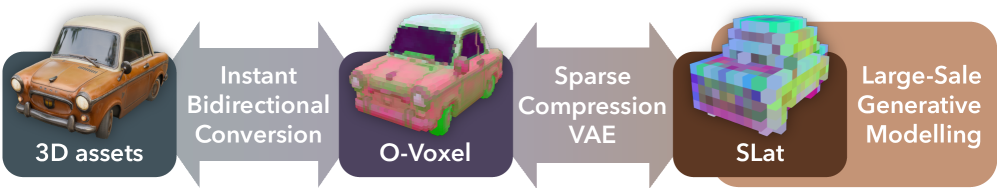
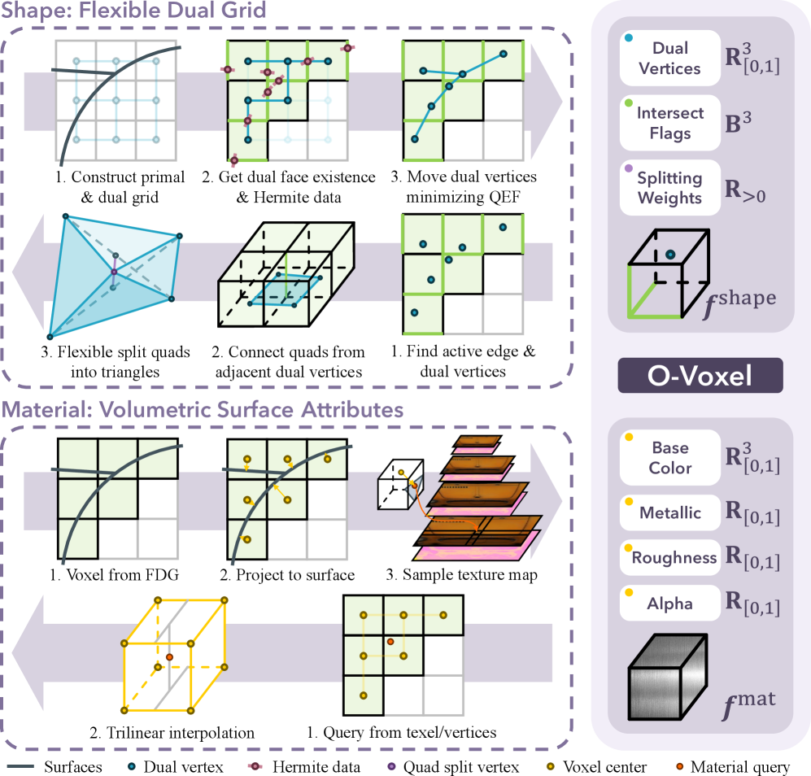
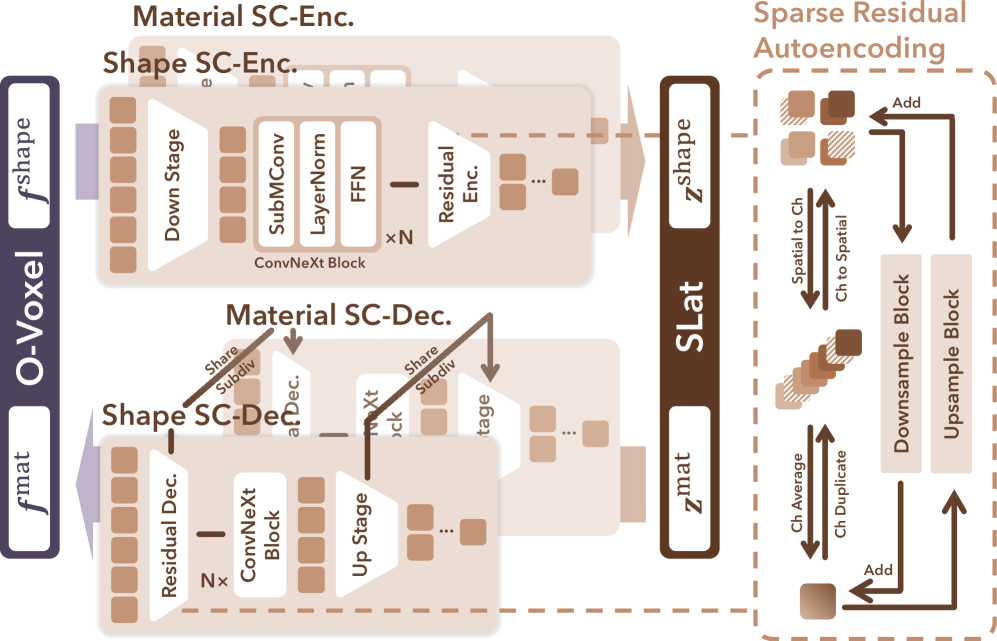
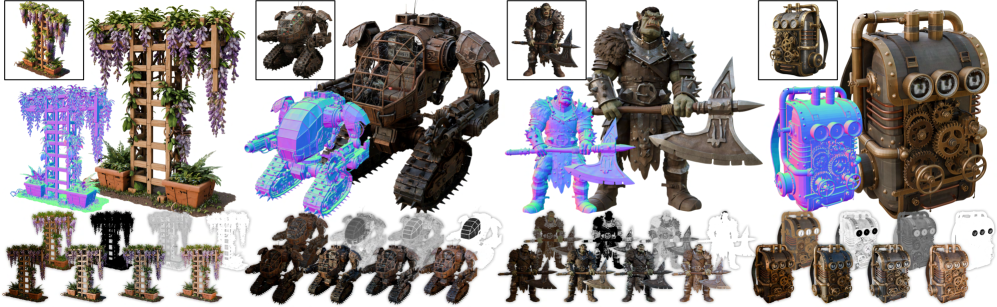

# TRELLIS.2 / O-Voxel 精读笔记

> **Native and Compact Structured Latents for 3D Generation**（即 **TRELLIS.2**）
> Jianfeng Xiang, Xiaoxue Chen, Sicheng Xu, ... Jiaolong Yang（Tsinghua / Microsoft Research / USTC / Microsoft AI）
> arXiv: https://arxiv.org/abs/2512.14692 ｜ v1
> 仓库：https://github.com/microsoft/TRELLIS.2 （MIT，代码/模型/数据**已开源**）
> 分组：**3D-native 生成基座（TRELLIS 谱系）**，为清单中的多种三维生成方法提供基础表示

---

## 本地实验验证（A100）

为了核对表示与转换流程，我使用官方 `o-voxel` 库在 A100 上将经典的 **DamagedHelmet.glb** 转换为 O-Voxel 并完成可视化。图中的点表示 Flexible Dual Grid 求解得到的表面顶点，颜色对应体素级 PBR `base_color`。


| 分辨率 | 占据体素数 | 几何体素化耗时 | 材质体素化耗时 |
|---|---|---|---|
| **64³** | 23,167 | **0.04 s** | 2.60 s |
| **256³** | 396,029 | **0.48 s** | 3.19 s |

本地实验验证了论文所述的以下关键性质：
- **几何转换达到单设备秒级**：64³ 分辨率耗时 **0.04 s**，256³ 分辨率耗时 **0.48 s**。该过程为 field-free 转换，不需要 SDF 拟合或逐资产优化。
- **稀疏性**：在 \(256^3\) 网格中，理论体素数约为 1677 万，实际活跃体素为 39.6 万，约占 2.4%。这一稀疏性是高分辨率表示保持可计算性的关键。
- **几何与 PBR 对齐**：每个占据体素同时带 `base_color/metallic/roughness`（图中颜色即真实 base_color）。
- **分辨率影响几何细节**：64³ 结果具有明显体素化特征，256³ 能够保留更多头盔铆钉和管线细节。

复现脚本、环境版本与运行命令见 [`reproductions/ovoxel/README.md`](../reproductions/ovoxel/README.md) 和 [`run_ovoxel.py`](../reproductions/ovoxel/run_ovoxel.py)：
- 在 A100 上用 CUDA 12.9 + torch 2.6(cu124) 编译 `o_voxel._C`（Flexible Dual Grid / QEF / 材质体素化的 C++/CUDA 核）；
- 由于 `flex_gemm` 和 `cumesh` 尚未提供可直接编译的完整依赖，本次实验临时禁用了 `o_voxel/__init__.py` 中的 `postprocess` 导入。该调整不影响 mesh 到 O-Voxel 的几何与材质体素化路径。

实验结论：本地结果复现了论文 Fig.3 所示 O-Voxel 的主要性质，包括 field-free 几何转换、稀疏存储和材质对齐。若需进一步执行 O-Voxel 到 mesh 或 `.glb` 的完整重建，还需要编译 `flex_gemm` 与 `cumesh`。

---

## 与 Sim2Real 研究主线的关系

> 本文研究三维生成与表示，不直接处理动力学或机器人任务，但它为清单中的多种物理资产生成方法提供了基础表示：
> - **TRELLIS(SLAT)** 是 [PAct](03-PAct.md)（微调 TRELLIS）、[PhysForge](02-PhysForge.md)（基于 OmniPart，而 OmniPart 建于 TRELLIS）、[PhysX-Omni](01-PhysX-Omni.md)（用 TRELLIS 解码器）的共同骨干。
> - TRELLIS.2 将 TRELLIS 的几何与颜色表示扩展为几何与完整 PBR 材质（base color、metallic、roughness、opacity），可为 sim-ready 和 graphics-ready 资产提供更一致的材质表达，并与 [LiteReality](05-LiteReality.md) 和 [GS-Playground](04-GS-Playground.md) 关注的视觉真实性形成对应。
> - 论文将部件级分割与图结构拓扑列为未来工作；这些能力正是上游三维生成表示向铰接和物理资产扩展时需要补充的结构信息。

---

## 核心思想

> TRELLIS.2 提出 **O-Voxel**，一种 field-free 的稀疏体素表示，用于联合编码任意拓扑几何与体素级 PBR 材质。几何部分通过 Flexible Dual Grid 直接由网格表面构造，不需要 SDF、flood fill 或逐资产优化；材质部分与活跃体素对齐，包含 base color、metallic、roughness 和 opacity。基于 O-Voxel，论文设计具有 16 倍空间下采样率的 Sparse Compression VAE（SC-VAE），并在其潜空间中训练三阶段 flow-matching 生成模型。

需要区分的是：本文所说的“physical material”指 PBR 光学属性，而不是质量、摩擦、碰撞或关节等动力学属性。因此 TRELLIS.2 是高质量三维资产生成基座，而不是完整的 simulation-ready 资产生成方法。

## 输入、输出与问题定义

### 表示学习任务

- 输入：带几何和 PBR 纹理的三维资产，通常以 mesh/glTF 形式提供。
- 中间表示：规则网格上 \(L\) 个活跃体素组成的 O-Voxel。
- 输出：可重建网格几何与 PBR 材质的紧凑 latent。

### 条件生成任务

- 输入：单张条件图像 \(I\)。
- 输出：具有复杂拓扑和 PBR 材质的三维资产，可进一步导出为 mesh 或 `.glb`。

O-Voxel 定义为

$$
\boldsymbol{f}
=
\left\{
(\boldsymbol{f}^{\mathrm{shape}}_i,
\boldsymbol{f}^{\mathrm{mat}}_i,
\boldsymbol{p}_i)
\right\}_{i=1}^{L},
\qquad
\boldsymbol{p}_i\in\{0,\ldots,N-1\}^3.
$$

其中 \(\boldsymbol{p}_i\) 是活跃体素坐标，\(\boldsymbol{f}^{\mathrm{shape}}_i\) 和 \(\boldsymbol{f}^{\mathrm{mat}}_i\) 分别编码局部几何与材质。

## 符号与核心公式

### 1. Flexible Dual Grid 的 QEF

给定网格与体素边的交点和法向 Hermite 数据 \(\{\boldsymbol{q}_i,\boldsymbol{n}_i\}\)，dual vertex \(\boldsymbol{v}\) 通过以下二次误差函数确定：

$$
\min_{\boldsymbol{v}\in\mathrm{voxel}} e(\boldsymbol{v})
=
\sum_i d_{\Pi,i}^2
+\lambda_{\mathrm{bound}}\sum_j d_{L,j}^2
+\lambda_{\mathrm{reg}}d_{\widehat{\boldsymbol{q}}}^2.
$$

其中

$$
d_{\Pi,i}^2
=
\left(\boldsymbol{n}_i\cdot
(\boldsymbol{v}-\boldsymbol{q}_i)\right)^2
$$

约束顶点靠近局部切平面；边界项 \(d_{L,j}^2\) 使顶点与开放边界对齐；正则项

$$
d_{\widehat{\boldsymbol{q}}}^2
=
\|\boldsymbol{v}-\overline{\boldsymbol{q}}\|_2^2
$$

抑制奇异解并改善顶点分布稳定性。

### 2. 体素级 PBR 属性

每个活跃体素的材质表示为

$$
\boldsymbol{f}^{\mathrm{mat}}_i
=(\boldsymbol{c}_i,m_i,r_i,\alpha_i),
$$

其中 \(\boldsymbol{c}_i\in[0,1]^3\) 为 base color，\(m_i\)、\(r_i\) 和 \(\alpha_i\) 分别为 metallic、roughness 和 opacity。

### 3. SC-VAE 两阶段损失

低分辨率阶段直接监督 O-Voxel 属性：

$$
\begin{aligned}
\mathcal{L}_{\mathrm{s1}}
={}&\lambda_v\|\widehat{\boldsymbol{v}}-\boldsymbol{v}\|_2^2
+\lambda_\delta\operatorname{BCE}(\widehat{\boldsymbol{\delta}},\boldsymbol{\delta})\\
&+\lambda_\rho\operatorname{BCE}(\widehat{\boldsymbol{\rho}},\boldsymbol{\rho})
+\lambda_{\mathrm{mat}}
\|\widehat{\boldsymbol{f}}^{\mathrm{mat}}-\boldsymbol{f}^{\mathrm{mat}}\|_1
+\lambda_{\mathrm{KL}}\mathcal{L}_{\mathrm{KL}}.
\end{aligned}
$$

高分辨率阶段加入渲染感知损失：

$$
\mathcal{L}_{\mathrm{s2}}
=
\mathcal{L}_{\mathrm{s1}}+\mathcal{L}_{\mathrm{render}}.
$$

渲染监督包含 mask、depth、normal、base color 以及 metallic-roughness-alpha 图，并组合 L1、SSIM 与 LPIPS。

### 4. Conditional Flow Matching

对数据 latent \(\boldsymbol{x}_0\) 与高斯噪声 \(\boldsymbol{\epsilon}\)，线性路径为

$$
\boldsymbol{x}(t)
=(1-t)\boldsymbol{x}_0+t\boldsymbol{\epsilon}.
$$

网络学习对应速度场：

$$
\mathcal{L}_{\mathrm{CFM}}(\theta)
=
\mathbb{E}_{t,\boldsymbol{x}_0,\boldsymbol{\epsilon}}
\left\|
\boldsymbol{v}_\theta(\boldsymbol{x}(t),t)
-(\boldsymbol{\epsilon}-\boldsymbol{x}_0)
\right\|_2^2.
$$

该目标分别用于稀疏结构、几何 latent 和材质 latent 的生成阶段。

## 核心机制图

### Fig.2 总览：O-Voxel 表示 → SC-VAE 紧凑潜空间 → 大 flow 模型生成


### Fig.3 O-Voxel 与 mesh 的高效双向转换

> mesh 到 O-Voxel 的转换在单 CPU 上耗时数秒，O-Voxel 到 mesh/材质的转换耗时数十毫秒；该过程不需要 SDF、flood fill 或迭代优化。

### Fig.4 SC-VAE 网络结构（全稀疏卷积 U-Net）


### Fig.5 生成结果：复杂几何与 PBR 材质（薄结构、开放面、半透明）


---

## 方法细节（精读）

### ① O-Voxel 几何 = Flexible Dual Grid（field-free 的 Dual Contouring）
- 在 `N×N×N` 规则栅格上存稀疏体素，每个活跃体素带一组特征元组。
- **关键区别于 DC**：不构造任何 SDF/标量场，**直接用 mesh 表面**判定边相交标志 + 赋 Hermite 数据 `{q_i, n_i}`；每条与 mesh 相交的边激活对应 dual face。
- dual vertex 用 **QEF（二次误差函数）闭式解**，含三项：face 项（贴表面）+ **boundary 项（对齐开放边界，处理开放面）** + regularization 项（平滑、防奇异）。
- 该表示能够保留锐边和法向不连续，并处理开放曲面、非流形结构与封闭内腔，不要求输入网格预先满足 watertight 条件。

### ② O-Voxel 材质 = 体素级 PBR（6 通道）
- 每个活跃体素的材质特征 `f_i^mat` 包含 **base color（RGB）、metallic、roughness 和 opacity**。这些属性遵循标准 PBR 参数化，并支持重新光照与半透明材质表达。

### ③ Sparse Compression VAE（SC-VAE）
- **全稀疏卷积 U-Net**：区别于 TRELLIS 和 SparseFlex 使用的 Transformer 架构，稀疏卷积在高分辨率下可降低计算与显存开销，并具有跨尺度泛化能力。
- **Residual Autoencoding（借鉴 DC-AE）**：使用非参数残差路径在空间维与通道维之间传递信息，以缓解高压缩率下的优化困难：
  - 下采样 ×2：把每体素 **8 个子体素聚到通道**（`stack 8C → avg_groups → C'=2C`）；
  - 上采样：对称的**通道→空间**分发（`unstack → dup_groups`）；空缺体素补零（稀疏性）。
- **ConvNeXt 风格残差块**：将两层卷积调整为一层卷积与较宽的 point-wise MLP（类似 Transformer FFN），在控制计算开销的同时提高表示能力。
- **两阶段训练**：① 低分辨率 + 直接 O-Voxel 重建损失(几何用 dual 顶点 MSE + dual face flag BCE) + KL；② 高分辨率 + 渲染感知监督，提升几何与材质保真。

### ④ 生成 = 4B flow-matching（image-to-3D，多段）
- 代码 pipeline 三段式：**sparse_structure（粗结构）→ shape_slat（几何，512 分辨率）→ tex_slat（材质/纹理）**，各自独立 flow 采样器（类 TRELLIS 但**几何与材质潜码分离**）。

### ⑤ FlexGEMM：自研高性能稀疏卷积后端
- 针对高稀疏数据，速度优于 Spconv / TorchSparse / fVDB / WarpConvNet（Fig.9）。

---

## 结构化速记

| 字段 | 内容 |
|---|---|
| **Problem** | 现有 3D 生成表示（SDF/Flexicubes 等 field-based）难表达开放/非流形/内腔，且多忽略材质；TRELLIS SLAT 靠多视图 2D 特征→复杂结构与材质有缺陷。 |
| **Input** | 单图（image-to-3D）；表示层输入为 mesh 资产。 |
| **Output** | 高保真 3D 资产：复杂拓扑几何 + 完整 PBR 材质（base color/metallic/roughness/opacity）、可 relight、可导 .glb。 |
| **Representation** | **O-Voxel**（field-free 稀疏体素：Flexible Dual Grid 几何 + 体素级 PBR）→ **SC-VAE 紧凑潜空间**。 |
| **Physical properties** | **无动力学/质量/铰接**；"物理"仅指 **PBR 材质**（光-面交互），非仿真物理。 |
| **Simulator compatibility** | 非仿真论文；产物 .glb 可进图形管线，但不带碰撞/关节/质量。 |
| **Main contribution** | ① O-Voxel 任意拓扑 + PBR 原生表示，秒级双向转换；② 全稀疏卷积 **SC-VAE** 高压缩紧凑潜空间；③ 4B flow 大模型，几何+材质质量超现有；④ **FlexGEMM** 稀疏卷积后端；⑤ `.vxz` 压缩格式。 |
| **Limitations（明确）** | ① 受**体素分辨率**限制：亚体素细节走样（两近平行面落同体素→dual 顶点取中间、材质被平均→模糊）；② 解码偶有**小洞**（稀疏解码难保完全封闭流形，需 mesh 后处理补洞）；③ **不含部件/语义结构**（未来加 part 分割 + 图拓扑）。 |
| **与我的 Sim2Real 项目关系** | **基座**：理解它=理解 [PhysX-Omni](01-PhysX-Omni.md)/[PhysForge](02-PhysForge.md)/[PAct](03-PAct.md) 的几何骨干来历；它的 PBR 材质对 graphics-ready/sim2real 视觉很关键；但要进物理仿真仍需在其上补**碰撞/质量/铰接**（正是清单里其它论文做的事）。 |

---

## 机理 ↔ 代码对照（GitHub 实现）

> 仓库：https://github.com/microsoft/TRELLIS.2 （MIT）。`o-voxel/` 是独立可装库，结构与论文 3.1 一一对应。

### ① Flexible Dual Grid 几何 = `o-voxel/o_voxel/convert/flexible_dual_grid.py`
- `mesh_to_flexible_dual_grid()` / `flexible_dual_grid_to_mesh()`：双向转换；
- 函数签名明确给出 QEF 三项默认权重：face=1.0、boundary=1.0、regularization=0.1。

```python
# o-voxel/o_voxel/convert/flexible_dual_grid.py
def mesh_to_flexible_dual_grid(
    vertices, faces, voxel_size=None, grid_size=None, aabb=None,
    face_weight=1.0,            # QEF: 贴 mesh 表面项
    boundary_weight=1.0,        # QEF: 对齐开放边界项 → 处理 open surface
    regularization_weight=0.1,  # QEF: 平滑/防奇异正则项
    timing=False):
    """... Returns: 占据体素索引(N,3) / dual 顶点 / 每体素相交 flag"""
    ret = _C.mesh_to_flexible_dual_grid_cpu(...)   # 核心算子 C++ CPU，印证"单 CPU 几秒"
```
- 与论文一致：face + boundary（开放面）+ regularization 三项 QEF；返回**占据体素索引 + dual 顶点 + 相交 flag**（无任何 SDF 场）。

### ② 体素级 PBR 材质 = `o-voxel/o_voxel/convert/volumetic_attr.py`
- 输出键 **`base_color` / `metallic` / `roughness`**（+ README 的 `opacity`），并支持从 glTF 的 `*_factor` / `*_texture` 烘焙到体素——证实"体素级对齐 PBR"。

### ③ .vxz 压缩 / 序列化 = `o-voxel/o_voxel/serialize.py` + `io/vxz.py`
- `encode_seq(..., mode='z_order' | 'hilbert')` 提供 CPU/CUDA 实现，使用 Z-order 或 Hilbert 曲线将稀疏体素坐标编码为 30-bit 序列码，以保留空间局部性。

```python
# o-voxel/o_voxel/serialize.py
def encode_seq(coords, permute=[0,1,2], mode='z_order'):   # coords:[N,3] → 30-bit code
    x, y, z = coords[:,permute[0]].int(), coords[:,permute[1]].int(), coords[:,permute[2]].int()
    if mode == 'z_order':
        return _C.z_order_encode_cuda(x, y, z) if coords.is_cuda else _C.z_order_encode_cpu(x, y, z)
    elif mode == 'hilbert':
        return _C.hilbert_encode_cuda(x, y, z) if coords.is_cuda else _C.hilbert_encode_cpu(x, y, z)
```
> 与 [PhysX-Anything](07-PhysX-Anything.md) 的"线性索引 + 连字符合并"目的一致（稀疏体素紧凑序列化），但这里走**空间填充曲线**保持局部性，服务稀疏卷积/压缩。

### ④ 三段式生成 = `trellis2/pipelines/trellis2_image_to_3d.py`
- 模型清单显式分三段：**`sparse_structure_flow_model` → `shape_slat_flow_model_512` → `tex_slat_...`**（几何潜码与材质潜码分离），独立采样器。`app.py` / `example.py` 给出端到端 image→3D + `app_texturing.py` 纹理化。

### ⑤ 可用工具
- `examples/`：`mesh2ovox.py` / `ovox2mesh.py` / `ovox2glb.py`（带 **UV 展开 + 纹理烘焙**导出 .glb）/ `render_ovox.py`。
- 即"Production Ready"——对想拿生成资产进图形/仿真管线的人很实用。

---

## 核对结果与开放问题

- ✅ O-Voxel 与 SLAT 的本质差异：field-free 原生 3D（mesh 直转）vs 多视图 2D 特征 + 渲染监督。
- ✅ PBR 通道：base color、metallic、roughness 和 opacity，已由论文公式与代码接口共同确认。
- ✅ QEF 三项、Z-order/Hilbert、三段生成：均在代码中验证。
- ✅ **推理时间**：论文在 NVIDIA H100 上报告 \(512^3\)、\(1024^3\) 和 \(1536^3\) 资产生成分别约为 3 秒、17 秒和 60 秒；正文未报告这些设置的峰值显存。
- ⚠️ **下游仿真语义**：opacity 用于渲染半透明材质；论文不涉及其在碰撞或动力学中的处理方式，接入仿真器时需单独定义碰撞几何。
