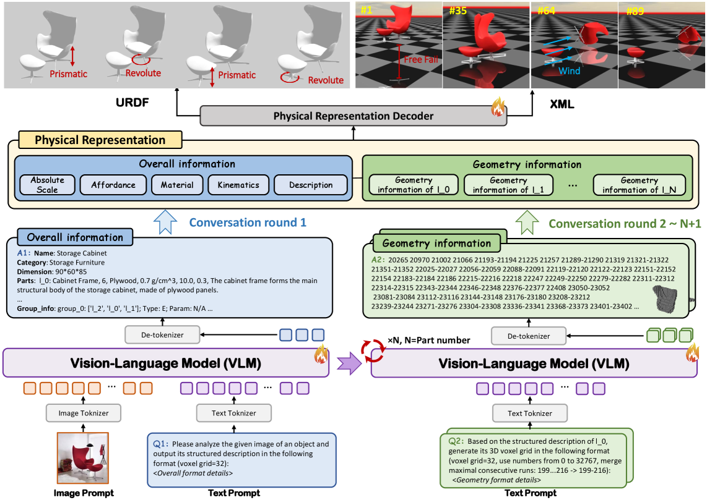
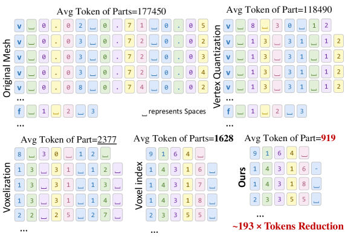
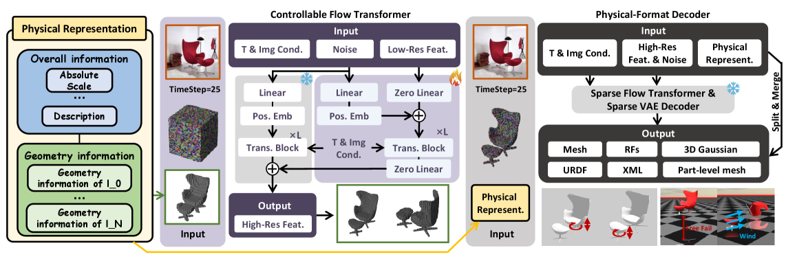

# PhysX-Anything 精读笔记

> **PhysX-Anything: Simulation-Ready Physical 3D Assets from Single Image**（**CVPR 2026**）
> Ziang Cao, Fangzhou Hong, Zhaoxi Chen, Liang Pan, Ziwei Liu（NTU S-Lab / Shanghai AI Lab）
> arXiv: https://arxiv.org/abs/2511.13648 ｜ v1
> 仓库：https://github.com/ziangcao0312/PhysX-Anything （代码 + PhysX-Mobility 数据集**已开源**）
> 分组：物理仿真 / Simulation-ready 生成

---

## 与 PhysX-Omni 的关系

PhysX-Anything 是 [PhysX-Omni](01-PhysX-Omni.md) 的前作，两者延续同一条技术路线：使用 VLM 生成全局物理描述与部件级显式几何，再将结果解码为 simulation-ready 资产。

- **PhysX-Anything**：采用 \(32^3\) 体素、线性索引序列化与连续区间合并，报告 193 倍 token 压缩率。
- **PhysX-Omni**：将表示升级为 \(64^3\) 模板化 RLE，并统一建模刚体、可形变物体和铰接物体。

PhysX-Anything 的工程路径较为明确：论文与仓库均提供 URDF/XML 和 MuJoCo-style 仿真示例，可用于验证“生成资产 → 导入仿真器”的完整流程。

---

## 核心思想

> PhysX-Anything 从单张自然图像生成带有显式几何、关节结构和物理属性的 simulation-ready 3D 资产。模型先通过多轮 VLM 对话生成全局物理描述与逐部件粗体素几何，再使用可控 flow Transformer 将 \(32^3\) 粗体素细化为高分辨率几何，最后结合结构信息导出 URDF、XML 和部件网格。

其核心表示将稀疏占据体素线性化，并把连续索引压缩为区间文本，在不扩展 VLM 词表的前提下降低序列长度。

---

> **个人判断**：本文可视为 PhysX 系列的早期工程闭环。几何表示的分辨率和表达能力弱于后续模板化 RLE，但导出格式与 MuJoCo-style 机器人实验说明该方法已经覆盖从图像生成到物理仿真的主要环节。

## 输入、输出与问题定义

### 输入

- 单张自然场景 RGB 图像 \(I\)。
- 训练监督包括对象层级结构、部件物理属性、部件体素以及关节参数。

### 输出

模型生成

$$
\mathcal{A}
=
\left(
Y^{\mathrm{global}},
\{V_i^{\mathrm{low}},V_i^{\mathrm{high}}\}_{i=1}^{K},
\mathcal{F}_{\mathrm{sim}}
\right),
$$

其中 \(Y^{\mathrm{global}}\) 为树状全局物理描述，\(V_i^{\mathrm{low}}\) 与 \(V_i^{\mathrm{high}}\) 分别为部件粗体素和细化体素，\(\mathcal{F}_{\mathrm{sim}}\) 表示 URDF、XML 与部件网格等仿真格式。

上述输出元组是本笔记为统一说明模型产物而增加的形式化表达，并非论文原式。

## 符号与核心公式

### 1. 体素索引与区间压缩

对 \(32^3\) 体素坐标 \((x,y,z)\)，源码使用

$$
\operatorname{idx}(x,y,z)
=(x\ll 10)\;|\;(y\ll 5)\;|\;z
=1024x+32y+z,
$$

将坐标映射到 \([0,32767]\) 的整数索引。设占据索引排序后为 \(n_1<\cdots<n_m\)，所有满足

$$
n_{j+1}=n_j+1
$$

的最大连续子序列被编码为 `start-end`。该操作只改变文本表示，不损失占据信息。

### 2. 可控 flow Transformer

细化阶段以低分辨率体素 \(\mathbf{V}^{\mathrm{low}}\) 和图像条件 \(c\) 为输入。论文定义线性插值

$$
x_t=(1-t)x_0+t\epsilon,
$$

其中 \(x_0\) 是高分辨率目标体素 latent，\(\epsilon\) 是高斯噪声。训练目标为

$$
\mathcal{L}_{\mathrm{geo}}
=
\mathbb{E}_{t,x_0,\epsilon,c,\mathbf{V}^{\mathrm{low}}}
\left[
\left\|
 f_\theta(x_t,c,\mathbf{V}^{\mathrm{low}},t)
-(\epsilon-x_0)
\right\|_2^2
\right].
$$

网络学习从数据样本指向噪声的速度场；推理时沿反向常微分方程从噪声恢复细粒度几何。

## 核心机制图

### Fig.2 总览：多轮对话 → 整体信息 + 逐部件几何 → 解码 sim-ready 资产


### Fig.3 token 压缩对比：mesh → 32³ 体素(74×) → 序列化+合并(193×)


### Fig.4 物理表示解码器：可控 flow transformer 细化几何 + format decoder 出 6 格式


---

## 方法细节（精读）

### ① 高压缩体素 token 表示（193×，本篇核心）
- 方法采用 coarse-to-fine 设计：VLM 仅预测 \(32^3\) 粗体素，下游解码器负责恢复细粒度几何，以平衡显式结构表达与 token 预算。
- 压缩三步：
  1. mesh → 32³ 粗体素：token 已降 **74×**；
  2. 把 32³ 栅格**线性化成 0..32³−1 的索引**，只序列化**占据**体素；
  3. **合并相邻连续索引**、用连字符 `-` 连接连续区间 → 再压到 **193×**，且保留显式几何结构、**不引入特殊 token**。
- **整体信息**：用树状 JSON（比 URDF 更丰富的物理属性+文本描述，利于 VLM 推理）；**运动学参数转进体素空间**（运动方向、轴位置、运动范围），保持运动学与几何一致。
- **防遗忘技巧**：逐部件几何生成时**只保留整体信息**作条件，各部件独立生成，避免长 prompt 上下文遗忘。

### ② 物理表示解码器（Fig.4）
- 粗几何 → **可控 flow transformer** 生成细粒度几何 → **format decoder** 结合整体物理信息输出 **6 种格式**（含 URDF & XML）。

### ③ 数据集 PhysX-Mobility
- 取自 **PartNet-Mobility** 并标注物理属性，**47 类 / >2K 物体**（厕所、风扇、相机、咖啡机、订书机…），类别比前作扩 **2×**。

### ④ 下游：MuJoCo-style 仿真
- sim-ready 资产直接导入 MuJoCo 做**接触丰富的机器人策略学习**（如安全操作眼镜等易碎物）。

---

## 机理 ↔ 代码对照（含真实代码）

> 仓库结构与 PhysX-Omni 几乎同构：`1_vlm_demo.py → 2_decoder.py → 3_split.py → 4_simready_gen.py`，外加 `render_urdf.py` / `mjcf_source/`。

### 193× 压缩 = `dataset/3generate_data_new_32_finetune.py`
**(a) 体素→单索引**（Morton 式 `(x<<10)|(y<<5)|z`，因 32=2⁵）：
```python
def voxel_encode(voxels: np.ndarray, size: int = 32) -> np.ndarray:
    voxels = np.asarray(voxels, dtype=np.int64)
    assert size == 32, "size=32（2^5）。"
    x, y, z = voxels[:, 0], voxels[:, 1], voxels[:, 2]
    return (x << 10) | (y << 5) | z          # 0..32767 单一索引
```
**(b) 相邻索引合并成 `start-end`**（论文 Fig.3 的"193×"关键一步）：
```python
def merge_adjacent_to_dash(s: str) -> str:
    nums = sorted(set(map(int, s.split())))
    result = []
    start = prev = nums[0]
    for n in nums[1:]:
        if n == prev + 1:          # 连续 → 延长当前 run
            prev = n
        else:                      # 断开 → 输出 "start-prev"
            result.append(f"{start}-{prev}" if start != prev else f"{start}")
            start = prev = n
    result.append(f"{start}-{prev}" if start != prev else f"{start}")
    return " ".join(result)        # e.g. "184 198 199-216 230-237"
```
- 训练 prompt 明确给出连续区间合并格式，与论文中的 193 倍压缩表示一致：
  > *"generate its 3D voxel grid ... voxel grid=32, use numbers from 0 to 32767, **merge maximal consecutive runs: 199...216 -> 199-216**: 184 198 199-216 230-237..."*
- **对照下一代**：PhysX-Omni 的 `runs_by_z_to_string_lossless()`（模板化 RLE，见 [PhysX-Omni](01-PhysX-Omni.md)）就是把这套"线性合并"换成"逐 z 切片 RLE + 模板层 delta"，并升到 64³。

### 导出 URDF/MJCF = `render_urdf.py` + `mjcf_source/`
- 仓库包含 URDF 生成与渲染脚本、MJCF/XML 生成函数和对象网格导出路径，确认该方法可接入 MuJoCo-style 仿真流程。

---

## 结构化速记

| 字段 | 内容 |
|---|---|
| **Problem** | 现有三维生成方法通常缺少物理属性和关节结构，难以直接用于仿真；已有铰接方法又常依赖资产检索，限制了对新类别和新结构的泛化。 |
| **Input** | 单张 in-the-wild 图。 |
| **Output** | sim-ready 物理 3D 资产（几何 + 铰接 + 物理属性），**导出 URDF/XML 等 6 格式**。 |
| **Representation** | VLM 友好：整体=树状 JSON；几何=32³ 体素**序列化+合并**（193× 压缩，无特殊 token）。 |
| **Physical properties** | 绝对尺度、密度、关节约束（方向/轴位置/运动范围，转进体素空间）。 |
| **Simulator compatibility** | ✅ **MuJoCo**：仓库提供 `render_urdf.py`、`mjcf_source/` 及相关资产导出路径，可用于接入 MuJoCo 仿真。 |
| **Downstream use** | 接触丰富机器人策略学习（易碎物安全操作）。 |
| **Main contribution** | ① 首个 sim-ready 物理 3D 生成范式；② VLM 友好的 193× 压缩几何表示（无特殊 token）；③ 数据集 **PhysX-Mobility**（47 类 >2K）。 |
| **Limitations** | （正文未设独立节）32³ 粗几何上限、依赖下游 flow 解码器细化；类别仍限 PartNet-Mobility 范围。 |
| **与我的 Sim2Real 项目关系** | 本文提供了较明确的“图像生成 → URDF/MJCF → MuJoCo-style 仿真”路径，可作为 simulation-ready 资产闭环的基线。其表示方式可与 [PhysX-Omni](01-PhysX-Omni.md) 的模板化 RLE 对照，关节建模可与 [PAct](03-PAct.md) 对照。 |

---

## 核对结果与开放问题

- ✅ token 压缩怎么实现：32³ 线性化 + 占据序列化 + 相邻合并 `start-end`（代码贴上）。
- ✅ 对接引擎：**MuJoCo**，导 URDF/XML（`render_urdf.py`/`mjcf_source`）。
- ✅ 与 PhysX-Omni 关系：本篇是前作/baseline，Omni 用模板化 RLE + 64³ + 统一三类物体升级。
- ⚠️ 论文称 format decoder 支持六种格式；当前仓库可明确确认 `.ply` 粗体素、`.glb` 完整资产、部件 `.obj`、结构化 JSON、URDF 和 MJCF/XML 产物，但论文未逐项列出其所指的六种最终格式。
- ✅ **与 TRELLIS 的关系**：可控 flow Transformer 以粗体素为条件生成细粒度体素；随后使用预训练 TRELLIS structured-latent 模型生成 mesh、radiance field 和 3D Gaussian 等表示。
