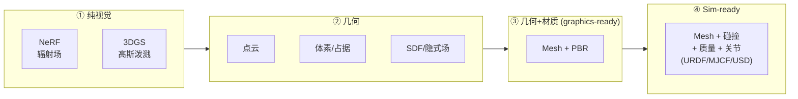

# 3D 表示梳理：我对各种 3D 表示的理解

> 入门时 mesh / 点云 / 体素 / SDF / NeRF / 3DGS / SLAT / O-Voxel / URDF 这些表示最容易把我绕晕，于是我把它们整理成这份速查。
> 我的核心认识：这批论文争的本质就是"**用什么表示来存 3D**"——因为表示直接决定了能不能渲染、能不能编辑、能不能进仿真。

---

## 0. 大局观：我把表示看成一根"阶梯"

不同表示装的"信息量"不同。从只够看、到能进仿真，是一条**逐级加料**的阶梯：

```text
只能看(视觉)         能算几何            能编辑/带材质         能物理交互(sim-ready)
NeRF / 3DGS    →    点云 / 体素 / SDF   →   Mesh + PBR 材质   →   Mesh + 碰撞 + 质量 + 关节(URDF)
└── 漂亮但是"一团" ──┘                                          └── 机器人能在里面干活 ──┘
```

> **核心命题**（贯穿全清单）：**视觉上好看 ≠ 能用于仿真**。NeRF/3DGS 重建的客厅很逼真，但只是"一团颜色和形状"，没有碰撞体/质量/关节，机器人没法在里面抓杯子。整条阅读线就是在**把表示从阶梯左端推到右端**。



---

## 1. 七种主要表示，逐个认

### ① Mesh（三角网格）—— 图形/仿真的"通用货币"
- **是什么**：顶点 + 三角面片 + UV 贴图/材质。你在 Blender/游戏里见的都是它。
- **优点**：可编辑、可渲染、**能赋碰撞体进仿真**，所有引擎都吃。
- **缺点**：**直接用网络生成很难**（拓扑/面数不规则），常需"先生成别的表示再转 mesh"。
- **谁用**：几乎所有论文的**最终输出**都是 mesh（再加物理属性）。

### ② 点云（Point Cloud）—— 传感器的原始吐出物
- **是什么**：一堆 3D 点（可能带颜色/法向），无连接关系。
- **优点**：深度相机/LiDAR **直接输出**，最贴近真实采集。
- **缺点**：没有面、没有拓扑、有洞有噪声，**不能直接渲染/仿真**，要先转成 mesh/体素。
- **谁用**：Real2Sim 的**输入端**（扫描）；URDF-Anything 类方法依赖干净点云。

### ③ 体素 / 占据栅格（Voxel / Occupancy）—— 3D 版"像素"
- **是什么**：把空间切成 N×N×N 小格，每格"占据/空"（或带特征）。
- **优点**：规整、**对神经网络友好**（像处理图像）。
- **缺点**：显存随分辨率 **O(N³) 爆炸**；细节受格子大小限制。**稀疏体素**（只存占据格）可缓解。
- **谁用**：[PhysX-Omni](01-PhysX-Omni.md) / [PhysX-Anything](07-PhysX-Anything.md) 用稀疏体素 + 文本序列化喂给 VLM；TRELLIS 系的底子也是稀疏体素。

### ④ SDF / 隐式场（Signed Distance Function / Implicit Field）
- **是什么**：一个函数，给空间任意点返回"到表面的带符号距离"；**零等值面 = 物体表面**。代表：DeepSDF、Flexicubes。
- **优点**：连续、天然**水密(watertight)**、分辨率无关。
- **缺点**：**只能表达封闭实心面**——开放面（一张纸）、非流形、内腔表达不了（这正是 TRELLIS.2 吐槽 field-based 的点）。
- **谁用**：很多 3D 生成的几何底座；[TRELLIS.2 / O-Voxel](06-TRELLIS2-OVoxel.md) 专门**反其道而行**（field-free）来解决它的短板。

### ⑤ NeRF（神经辐射场）—— "拍一圈照片，重建出能换视角的场景"
- **是什么**：用一个 MLP，输入 5D（位置 xyz + 视角方向）→ 输出颜色 + 体密度；沿光线**体渲染**积分成像素。
- **优点**：新视角合成**照片级**真实。
- **缺点**：是隐式"一团"，**不可编辑、无显式几何、无物理、渲染慢**。
- **谁用**：清单里主要作为**对比/背景**（GS-Playground 选了更快的 3DGS 而非 NeRF）。


> NeRF 机理：5D 输入 → MLP 出颜色+密度 → 体渲染积分 → 与真图比对反传。

### ⑥ 3DGS（3D 高斯泼溅）—— NeRF 的"快且显式"替代
- **是什么**：用一大堆**3D 高斯椭球**（位置/形状/颜色/不透明度）显式表示场景，可微**光栅化**渲染。
- **优点**：**实时**、高质量、显存可控。
- **缺点**：**偏视觉表面**，默认没有 mesh/碰撞——要进仿真得另配几何。
- **谁用**：[GS-Playground](04-GS-Playground.md) 的核心渲染表示（配点剪枝 + RLGK 绑刚体才能做仿真）。


> 3DGS 机理：SfM 点云 → 3D 高斯 → 可微 splatting + 自适应增删。

### ⑦ 结构化隐码 SLAT / O-Voxel —— 3D **生成**的"中间表示"
- **是什么**：稀疏体素 + 每体素特征，作为生成模型的潜空间。TRELLIS 的 SLAT；TRELLIS.2 的 **O-Voxel**（几何 + PBR 材质，且 field-free 能处理开放/非流形面）。
- **优点**：网络好处理、可解码成 mesh/3DGS 等多格式、**专为生成设计**。
- **缺点**：本身是中间产物，要解码才成可用资产；受体素分辨率限制。
- **谁用**：[TRELLIS.2 / O-Voxel](06-TRELLIS2-OVoxel.md) 是它的最新形态；[PhysX-Omni](01-PhysX-Omni.md)/[PhysForge](02-PhysForge.md)/[PAct](03-PAct.md) 的几何骨干都源于此。


> O-Voxel：几何(Flexible Dual Grid) + 体素级 PBR，mesh↔O-Voxel 秒级双向转换。

### ⑧（不是几何，但很关键）URDF / MJCF / USD —— "sim-ready 的打包格式"
- **是什么**：不是一种几何表示，而是**把几何 + 碰撞体 + 质量 + 关节 + 材质打包**给仿真器的描述文件。URDF(ROS/通用)、MJCF(MuJoCo)、USD(Isaac/Omniverse)。
- **为什么重要**：**"能导出这些格式" ≈ "真能进仿真器"**。这是整条阅读线的"终点形态"。
- **谁用**：[PhysX-Anything](07-PhysX-Anything.md) 导 URDF/XML 直进 MuJoCo；[PAct](03-PAct.md) 有 `json_to_urdf.py`；铰接参数(关节轴/范围)就是为填这些文件而生。

---

## 2. 一张表看懂"谁能干什么"

| 表示 | 来源 | 直接渲染 | 显式几何 | 可编辑 | 含材质 | 能进仿真(碰撞/物理) | 清单里谁用 |
|---|---|:--:|:--:|:--:|:--:|:--:|---|
| **Mesh** | 转换/美术 | ✅ | ✅ | ✅ | ✅(贴图/PBR) | ✅(加碰撞) | 所有论文最终输出 |
| **点云** | 扫描/LiDAR | ❌ | ⚠️无面 | ❌ | ⚠️ | ❌ | Real2Sim 输入 |
| **体素/占据** | 体素化 | ❌ | ✅(粗) | ⚠️ | ⚠️ | ⚠️转mesh后 | PhysX 系、TRELLIS 底子 |
| **SDF/隐式场** | 学习/拟合 | ❌(需提面) | ✅(水密) | ❌ | ❌ | ⚠️转mesh后 | 多数生成几何底座 |
| **NeRF** | 多视角图 | ✅(慢) | ❌一团 | ❌ | ⚠️隐含 | ❌ | 背景/对比 |
| **3DGS** | 多视角图/SfM | ✅(快) | ❌偏表面 | ⚠️ | ⚠️隐含 | ❌(需另配几何) | GS-Playground #4 |
| **SLAT/O-Voxel** | 生成中间码 | ❌(需解码) | ✅ | ⚠️ | ✅(O-Voxel带PBR) | ⚠️解码+加物理 | TRELLIS.2 #6 + 生成类骨干 |
| **URDF/MJCF/USD** | 打包导出 | (取决mesh) | ✅ | ✅ | ✅ | ✅✅ **就是为它而生** | PhysX-Anything/PAct 导出 |

> 我读这张表的方式：**越往下、越靠右，越"sim-ready"**。NeRF/3DGS 在"好看"那头，URDF 在"能干活"那头，中间的体素/SLAT 是**生成时的工作表示**。

---

## 3. 我的学习与选型思路

### 想快速看懂论文：我认为补这 3 个表示就够入门
1. **Mesh**（最基础，知道顶点/面/UV/碰撞体即可）——所有论文的终点。
2. **体素 + SLAT**（读懂 [TRELLIS.2 / O-Voxel](06-TRELLIS2-OVoxel.md) 的图就懂大半）——生成类的工作表示。
3. **3DGS**（读 §1⑥ 那张图）——重建类(#4)的核心。

NeRF/SDF/点云我目前只求理解概念、不深挖；URDF 知道"它是 sim-ready 打包格式"即可。

### 若要给具体课题选表示：我按目标倒推
| 目标 | 我会选的表示 | 对应清单里的谁 |
|---|---|---|
| 真实场景搬进仿真、要照片级 + 高吞吐训练 | **3DGS**（+碰撞另配） | [GS-Playground](04-GS-Playground.md) |
| 真实场景搬进仿真、要可编辑/结构化资产 | **检索 Mesh + PBR** | [LiteReality](05-LiteReality.md) |
| 从图生成单个物体、要带物理/铰接进 MuJoCo | **体素→mesh→URDF** | [PhysX-Anything](07-PhysX-Anything.md)/[PhysX-Omni](01-PhysX-Omni.md) |
| 生成铰接物体（门/抽屉） | **SLAT + 关节回归→URDF** | [PAct](03-PAct.md) |
| 只要高质量几何+材质（先不管物理） | **O-Voxel / SLAT** | [TRELLIS.2 / O-Voxel](06-TRELLIS2-OVoxel.md) |

### 我的一句话决策
> 要"好看"选 3DGS/NeRF；要"能生成"选 体素/SLAT；要"能进仿真"最终都得落到 Mesh+碰撞，并导出 URDF/MJCF/USD。我理解每篇论文的本质，就是在这条链上选了不同的起点和终点。

---

## 4. 我做的可视化 notebook

为了把上面的表示真正"看见"，我写了一个可运行的 Jupyter notebook：[3d_representations_tutorial.ipynb](3d_representations_tutorial.ipynb)（或看 [HTML 预览](3d_representations_tutorial.html)，无需 Jupyter）。

它用程序生成一张"桌子"，把本文讲的表示一一画出来对比：
Mesh → 点云(采样) → 体素(体素化) → SDF(距离场 + marching cubes) → 稀疏体素(SLAT 直觉) → 3DGS 2D 示意，共 7 张图。

重跑命令（最小依赖见 [`../environments/tutorial-requirements.txt`](../environments/tutorial-requirements.txt)，纯 CPU 几秒）：
```bash
python -m venv .venv
.venv/bin/pip install -r environments/tutorial-requirements.txt
.venv/bin/jupyter nbconvert --to notebook --execute --inplace notes/3d_representations_tutorial.ipynb
```
用到 `numpy / matplotlib / trimesh / scikit-image / scipy`。我发现改代码（换形状、调体素分辨率 16³/32³/64³、改采样点数）最能加深理解。

## 5. 进一步：真实仓库

以下实现位于相应项目的上游仓库：
- **体素↔mesh 真实实现**：`TRELLIS.2/o-voxel/examples/mesh2ovox.py`、`ovox2mesh.py`。我已在 A100 上实跑：DamagedHelmet → 真实 O-Voxel（64³/256³），结果与复现说明见 [06-TRELLIS2-OVoxel.md 的"实跑验证"](06-TRELLIS2-OVoxel.md)，公开脚本见 [`reproductions/ovoxel/run_ovoxel.py`](../reproductions/ovoxel/run_ovoxel.py)。
- **生成→URDF→MuJoCo**：`PhysX-Anything/` 的 `1_vlm_demo.py → … → render_urdf.py`。
- **3DGS 剪枝**：`GS-Playground/benchmark/scripts/prune_gaussians.py`。
