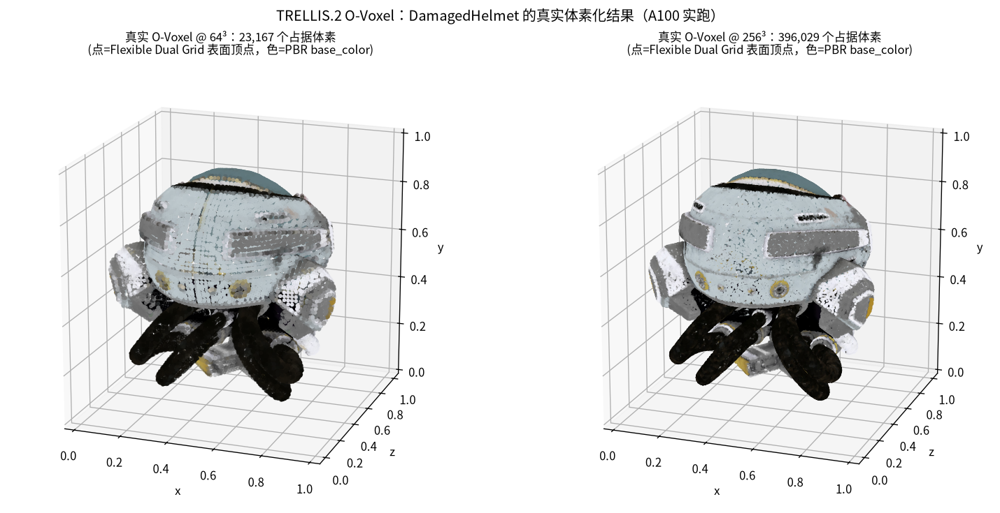

# TRELLIS.2 O-Voxel Reproduction

This experiment converts the public DamagedHelmet mesh into O-Voxel
representations at resolutions `64^3` and `256^3`, samples volumetric PBR
attributes, and visualizes Flexible Dual Grid surface vertices using base color.

## Setup

1. Clone [TRELLIS.2](https://github.com/microsoft/TRELLIS.2).
2. Install its `o-voxel` package and dependencies.
3. Obtain the DamagedHelmet GLB used by the upstream O-Voxel example.

## Command

```bash
python reproductions/ovoxel/run_ovoxel.py \
  --input /path/to/helmet.glb \
  --output notes/figures/ovoxel_real_helmet.png
```

The successful A100 run produced 23,167 occupied voxels at `64^3` and 396,029
at `256^3`.



See [`notes/06-TRELLIS2-OVoxel.md`](../../notes/06-TRELLIS2-OVoxel.md#本地实验验证a100).
